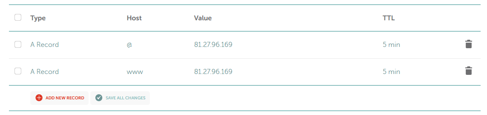
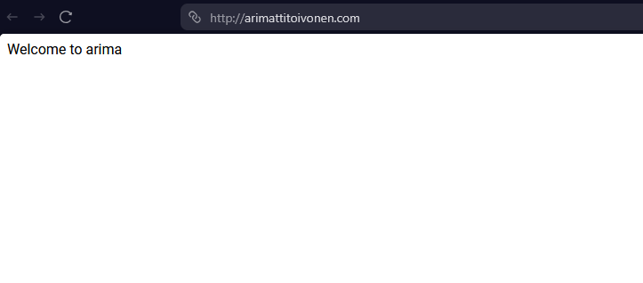
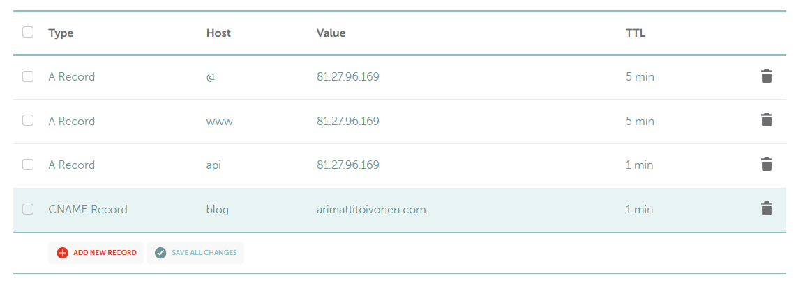
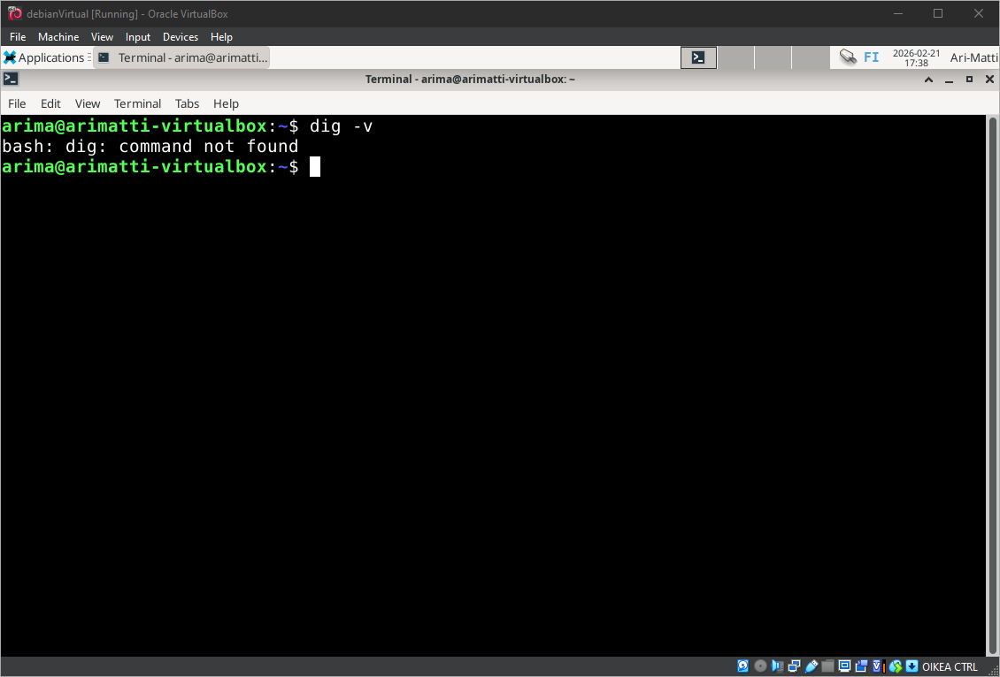
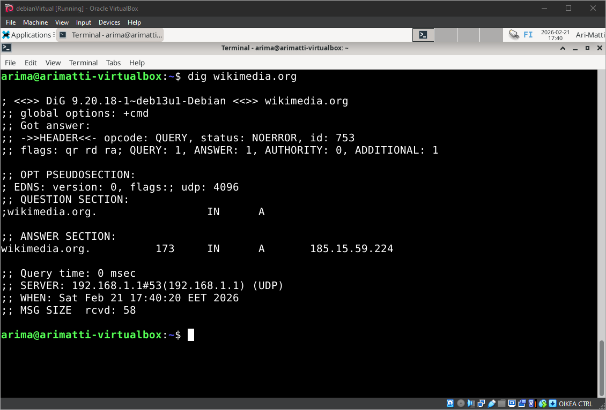
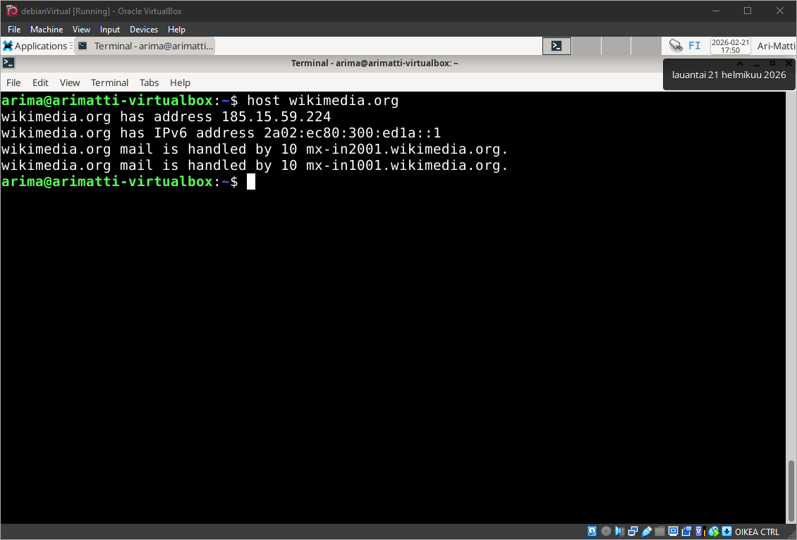

# H5 - Nimi
Tehtävän tarkoituksessa on laittaa pystyyn nimi-pohjainen nettipalvelin, ja tarkastella DNS tietoja.

## Käyttöympäristön tiedot
Tätä tehtävää suoritetaan käyttäen VirtualBoxia. Host-tietokoneena toimii pöytätietokone:

    Processor Intel(R) Core(TM) i7-6700K CPU @ 4.00GHz 4.00 GHz
    Installed RAM 16,0 GB
    Graphics Card NVIDIA GeForce RTX 3080 (10 GB)

## A - Nimi
Tehtävässä on tarkoitus asettaa palvelimelle julkinen nimi. Omistin jo domainin arimattitoivonen.com entuudestaan, ja se oli alunperin GoDaddy palvelun kautta. Päätin siirtää domainin namecheap palveluun.
Osoittaakseni domainin kohti web palvelintani, on luotava namecheapin Advanced DNS kontrollipaneelissa muutama tietue.

- Ensin lisäämme A tietueen osoittamaan web palvelimme ip osoitteeseen:
  - Lisäämme A-tietueen @ osoittamaan palvelimen IP:seen. Tämä kattaa juuridomainin (arimattitoivonen.com)
  - Lisäämme A-tietueen WWW osoittamaan palvelimen IP:seen. Tämä kattaa www-alidomainin (www.arimattitoivonen.com)
  - Asetamme TTL arvon suhteellisen pieneksi jotta mahdolliset virheiden korjaus päivittyy nopeasti.



- Navigoimme domainiin ja se näyttää ohjautuvan oikein pelkistetylle etusivullemme.



- Tässä on käytössä vain http protokollaa, eikä turvallisempaa https. Tämä tulisi korjata myöhemmin.

## B - Alidomain
Tässä tehtävässä luomme kaksi alidomainia sivulle. Teknisesti loimme jo yhden luomalla www-tietueen, mutta teemme silti kaksi lisää.

- Lisäämme yhden A-tietueen ja yhden CNAME tietueen:
  - A-tietue "api" osoittaa palvelimen IP:seen. Tämä luo alidomainin api.arimattitoivonen.com
  - CNAME tietue "blog" osoittaa domainiin arimattitoivonen.com. Tämä luo alidomainin blog.arimattitoivonen.com
 


- CNAME tietue osoittaa aina toiseen domainnimeen, ei IP-osoitteeseen.

## C - dig & host
Tässä tehtävässä tutkimme jonkin nimen DNS-tietoja 'dig' ja 'host' komennoilla.

- Ensin tarkastamme onko dig-komento käytettävissä koneessamme tarkistamalla sen version. Teemme sen komennolla.

```
dig -v
```



- Vastaus tarkoittaa, että koneella ei ole dig-komentoa, joten asennamme sen pakettimanagerilla.

```
sudo apt-get update
sudo apt-get install dnsutils
```

- Sitten ajamme dig komennon, ja tarkastelemme wikimedia.org tietoja.

```
dig wikimedia.org
```



- Tämä on se mitä kysyttiin:

```
;; QUESTION SECTION:
;wikimedia.org.			IN	A
```

- Tämä tarkoittaa "mikä on wikimedia.org domainin A-tietue?"
  - Kyseltiin A-tietuetta, koska emme lisänneet komentoon mitään flageja, ja A-tietue on oletus.
- Vastauksen relevantti osio on tämä:

```
;; ANSWER SECTION:
wikimedia.org.		173	IN	A	185.15.59.224
```

- Tämä tarkoittaa: "wikimedia.org A tietue löytyy IP osoitteesta".
- Luku 173 on TTL sekunteina (tieto on välimuistissa vielä 173 sekuntia ennen kuin se haetaan uudelleen)

- Seuraavaksi ajamme 'host' komennon samaan kohteeseen.

```
host wikimedia.org
```



- Host palautaa useamman tietueen kerralla.

```
wikimedia.org has address 185.15.59.224
```

- Sama tieto kuin äskeisessä dig-kyselyssä.

```
wikimedia.org has IPv6 address 2a02:ec80:300:ed1a::1
```

- Sivun AAAA-tietue, eli sen 128-bittinen IPv6 osoite.

```
wikimedia.org mail is handled by 10 mx-in2001.wikimedia.org.
wikimedia.org mail is handled by 10 mx-in1001.wikimedia.org.
```

- Sivun MX-tietueet, eli mihin sähköposti ohjataan kun lähetetään @wikimedia.org-osoitteeseen.
- Luku 10 on prioriteetti. Se on molemmissa palvelimissa sama, joten liikenne jakautuu niiden välille tasaisesti.

# Lähteet
- https://uptimerobot.com/knowledge-hub/devops/dns-redirect-guide/#what-is-a-dns-redirect
- https://www.cloudflare.com/learning/dns/dns-records/dns-cname-record/
- https://linuxize.com/post/how-to-use-dig-command-to-query-dns-in-linux/
- https://www.geeksforgeeks.org/linux-unix/host-command-in-linux-with-examples/
- https://www.cloudflare.com/sv-se/learning/dns/dns-records/dns-aaaa-record/
- https://www.cloudflare.com/learning/dns/dns-records/dns-mx-record/
