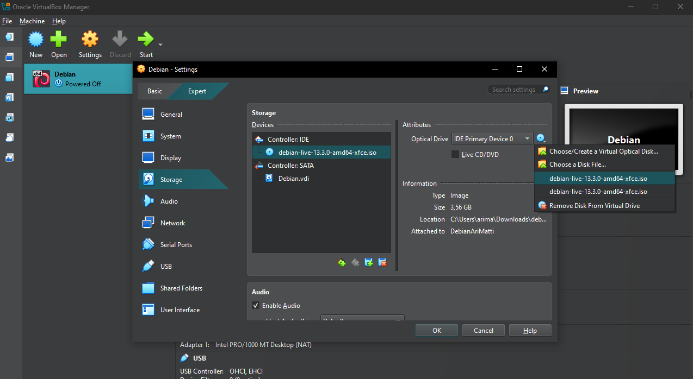

# H1 - Oma Linux

## Osa X - Artikkelit

Luin seuraavat artikkelit:
* GNU.org: "What is Free Software" - https://www.gnu.org/philosophy/free-sw.html
* Välimäki, Mikko 2015: "The Rise of Open Source Licensing", luku 5. Luettavissa: https://aaltodoc.aalto.fi/items/a128f25b-cdb3-416e-b007-62d639a1c228
Molemmat luin 18.1.2026, klo 21.30

### What is Free Software
- Vapaaseen ohjelmistoon kuuluu neljä olennaista vapautta: vapaus ajaa ohjelmaa mihin tahansa tarkoitukseen, vapaus tutkia ja muokata lähdekoodia, vapaus kopioida, ja vapaus jakaa muokattuja versioita.
- Vapaa ohjelmisto voi olla kaupallista.
- Ero "open sourceen" on filosofinen, vapaa ohjelmisto korostaa käyttäjien vapautta.
- Lisenssin tulee taata vapaudet pysyvästi ja peruuttamattomasti, eikä saa asettaa rajoituksia jotka käytännössä estävät käyttäjän vapauksia.

### Open Source Licenses as Alternative Governance Mechanisms
- Avoin lähdekoodi määritelmä: Open Source Initiative hyväksyy lisenssit, jotka sallivat vapaan käytön, kopioinnin ja muokkaamisen ilman provikoita sekä vaativat lähdekoodin saatavuuden
- Lisenssit voi jakaa toiminnallisuuden perusteella kolmeen kategoriaan: vahva vastavuoroisuus, standardi vastavuoroisuus, ja salliva (permissive).
- Lisenssit usein jaetaan GNU-, akateemisiin-, yhteisö- ja yrityslisensseihin
- GNU GPL (General Public License) vaatii, että kaikki johdannaistyöt on lisensoitava GPL:n ehdoilla, mikä estää lähdekoodin sulkemisen
- GNU LGPL (Lesser GPL) sallii linkittämisen suljettuun ohjelmistoon. Vain LGPL-kirjaston suorat muutokset on jaettala lisenssin ehdoilla
- BSD (Berkeley Software Distribution) on vanhin ja tunnetuin salliva lisenssi, joka sallii lähdekoodin sulkemisen, ja uudelleen lisenssoinnin
- CC (Creative Commons) perustettiin 2001 stardisoimaan vapaampia lisenssiehtoja sisällölle.
- Kaikki CC-lisenssit sallivat kopioinnin ja jakelun ilman maksuja, ja lisenssiin voi valita muita rajoituksia, kuten kaupallisen käytön rajoituksen tai johdannaistyön jakamispakon

## Osa A - Linuxin asennus VirtualBoxiin

Käytössäni on Windows 10 käyttöjärjestelmää pyörittävä pöytäkone.

- 22:10 Latasin VirtualBox asennusohjelman (https://www.virtualbox.org/wiki/Downloads), ja ajoin sen
- 22:14 Latasin debian-live-13.3.0-amd64-xfce.iso -ISO-tiedoston (https://cdimage.debian.org/debian-cd/current-live/amd64/iso-hybrid/)
- 22:20 VirtualBoxissa loin uuden virtuaalikoneen (Machine > New)

Virtuaalikoneen resurssit:

- 22:30 Käynnistin virtuaalikoneen (Start -> Start with GUI)
  - Törmäsin virheeseen "VT-x is disabled in the BIOS for all CPU modes", minun pitäisi siis laittaa tämä päälle koneeni BIOS asetuksissa.
- 9.10 Uusi yritys, virtualisaatioasetukset päälle BIOSissa ja VirtualBox käyntiin
- 9.13 Virtuaalikoneen boottaus epäonnistui:

- Saman ISOn syöttäminen ylläolevaan tuotti saman virheen
- 9.18 tein uuden VM koneen, en asettanut ISOa luonnin yhteydessä vaan laitoin sen jälkeenpäin asetuksista:

