# H2 Komentaja Pingviini

Tätä tehtävää suoritetaan käyttäen VirtualBoxia.
Host-tietokoneena toimii pöytätietokone:
- Processor	Intel(R) Core(TM) i7-6700K CPU @ 4.00GHz   4.00 GHz
- Installed RAM	16,0 GB
- Graphics Card	NVIDIA GeForce RTX 3080 (10 GB)

## A - Micro
Tehtävänä on asentaa Micro tekstieditori.

- Terminaalissa kirjoitetaan komento
```sudo apt-get install micro```
- Tämä asensi Micron koneelle:

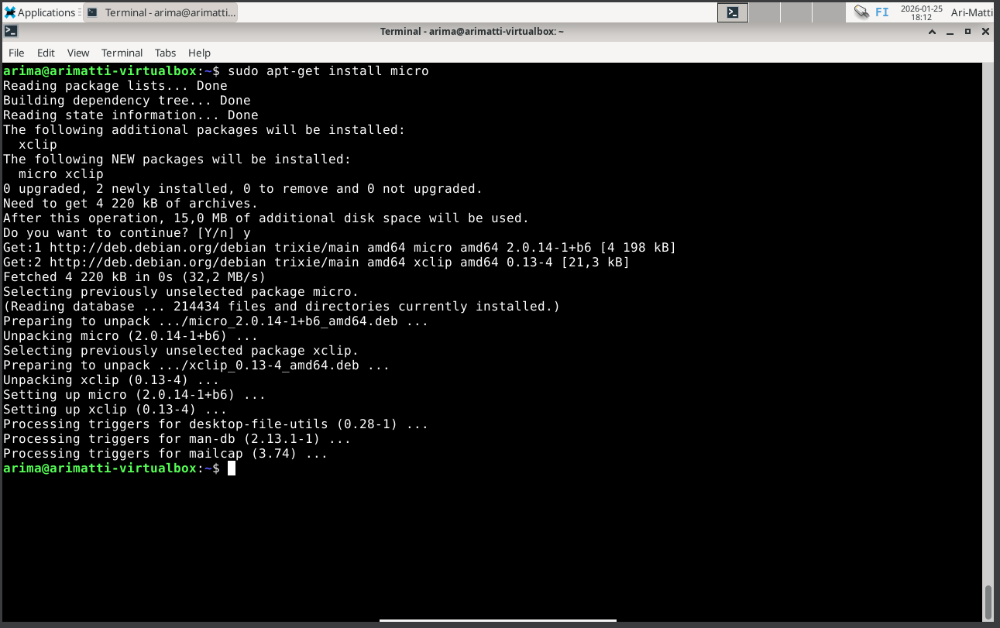

- Testatakseni, että Micro on asentunut, käynnistän sen kirjoittamalla komennon

```micro```

- Micro lähtee käyntiin odotetusti:

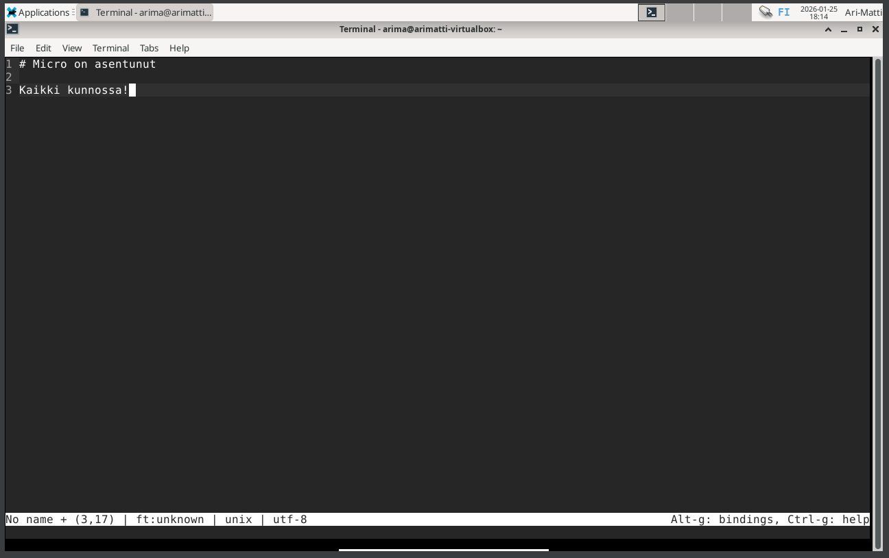

## B - Apt
Tehtävänä on asentaa kolme itselleni uutta komentoriviohjelmaa, ja kokeilla niitä.
Valitsemani ohjelmat on Crawl (tai dungeon-crawl-stone-soup, komentorivipohjainen-roguelike peli), htop (visuaalinen prosessienhallinta) ja ranger (tiedostonhallinta esikatseluilla).

- 18.35 Koetan asentaa nämä yhdellä komennolla:

```
sudo apt-get -y install crawl htop ranger
```

- Kaikesta päätellen asennus on onnistunut:

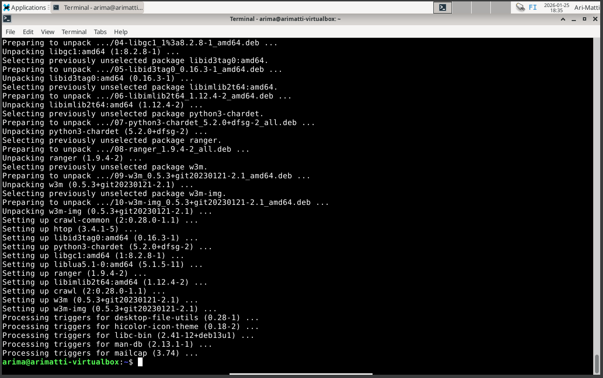

- 18.36 Koetan avata htopin komennolla

```htop```

- Ohjelma avautuu normaalisti ja näyttää meneillään olevat prosessit

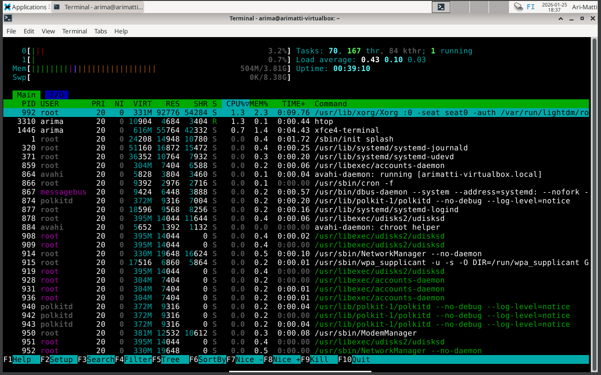

- **Ongelma:** Ohjelman sulkukomento F10 avaakin terminaalin File-valikon:

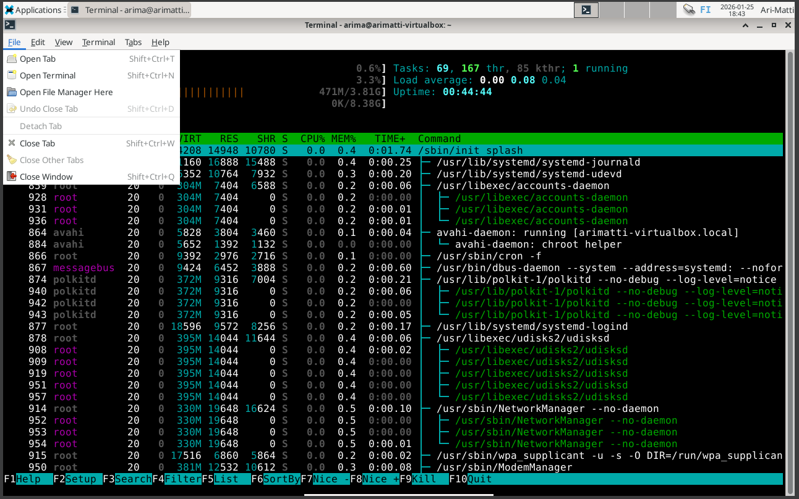

- Lähdin etsimään ratkaisua oikotienäppäimistä. Erotiun F10 näppäimen terminaalin oikotienäppäimistä menemällä Edit -> Preferences -> Shortcut ja poistamalla näppäimen kohdasta 'Show Menubar Temporarily'. Tämä ei ole toiminto jolle nään muutenkaan hyötyä.

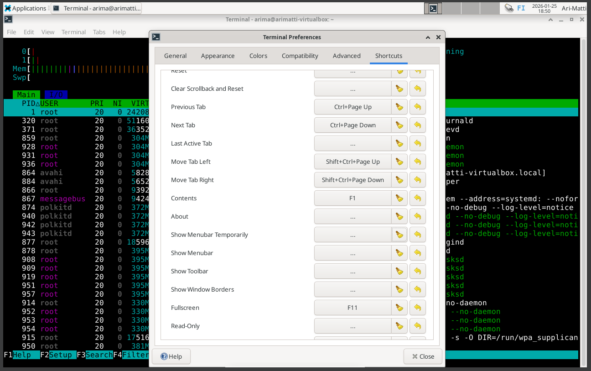

- Jostain syystä tämä ei lopettanut menun avaamista f10. Etsin vastausta xfce dokumentaatiosta, ja löysin toisen asetuksen, joka liittyy valikon oikotiehen. Tämä löytyy Edit -> Preferences -> Disable menu shortcut key.

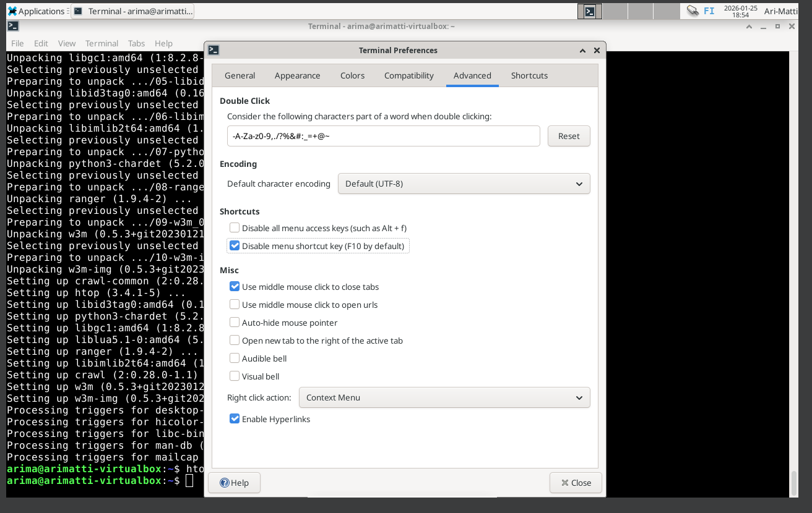

- Tämä irroitti f10 toiminnot terminaaliohjelman hallusta, ja se toimi. Syy sille, miksi pelkkä oikotiennäppäimen poisto ei toiminut, tai sille, miksi tämä asetus löytyy käytännössä kahdesta eri paikasta, on minulle mysteeri.

- 19.00 Tästä selviydyttyäni kokeilen muita asentamiani ohjelmia. Seuraavaksi vuorossa on ranger. Avaan sen komennolla:

```ranger```

- Ranger avautui odotetusti, joskin tallennettuja tiedostoja ei kotihakemistossa tällä hetkellä ole:

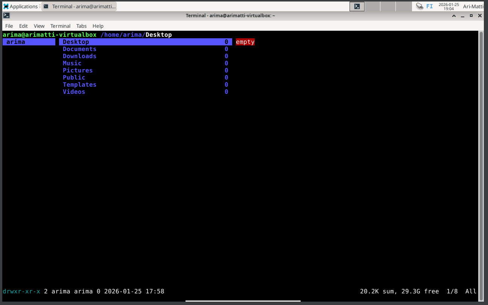

- Rangerilla pääsen kuitenkin selaamaan vaikka /etc/ tiedostoja:

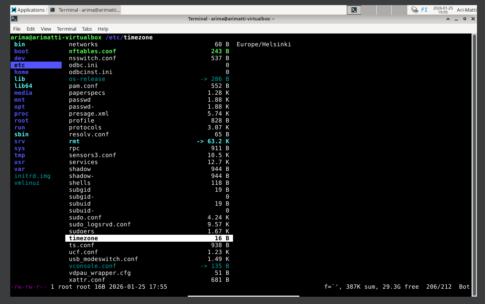

- 19.06 Viimeiseksi kokeilen crawlin toimivuutta:

```crawl```

- Tämä avaa odotetusti DCCS :n päävalikon:

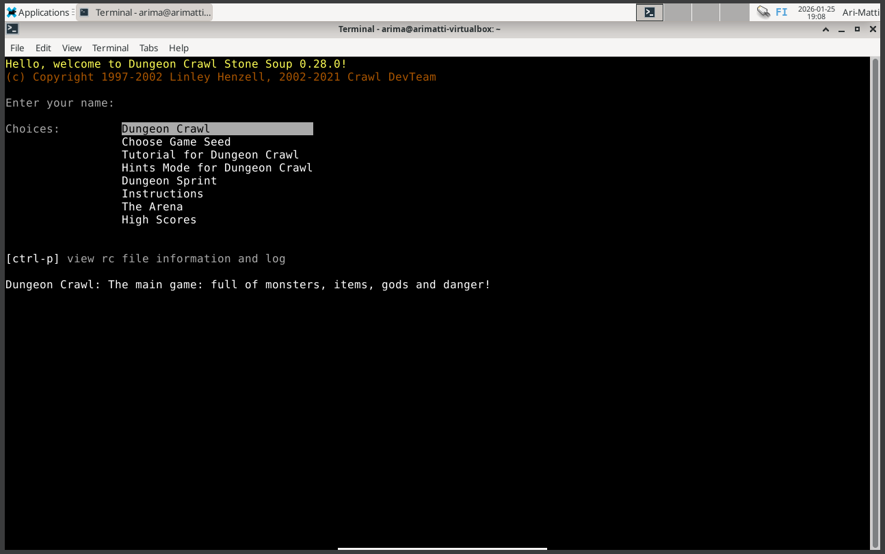

- Peli käynnistyy normaalisti, ja aloitan uuden pelin luomalla Merfolk Transmuterin, nimeltään Teuvo:

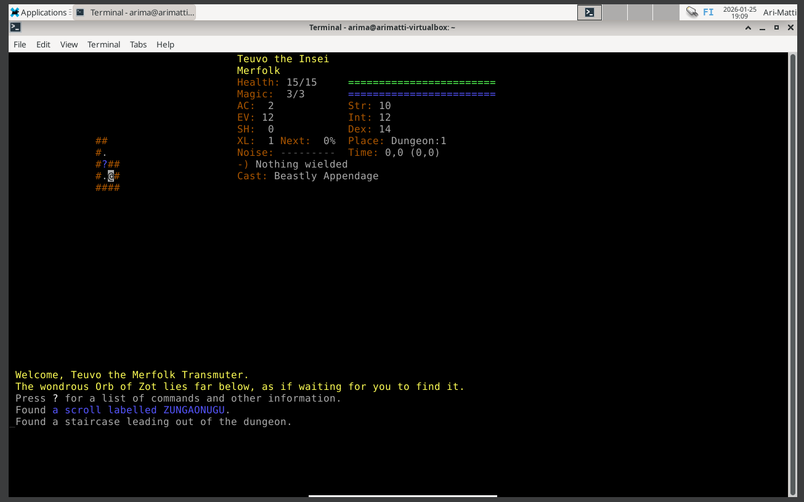

## C - FHS
Tässä tehtävässä esittelen tärkeät kansiot, jotka ovat listattu Command Line Basics Revisited -artikkeliin.

### /home/
- Tämä kansio sisältää kaikkien käyttäjien kotikansiot, mihin he voivat tallentaa tietoja. Tällä hetkellä koneella on vain yksi käyttätä 'arima'.

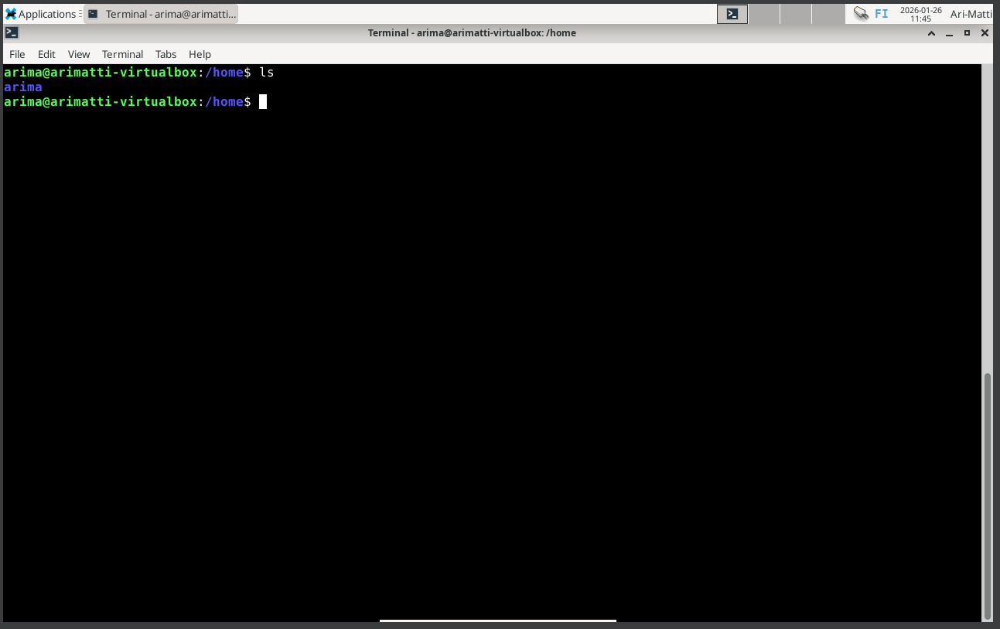

#### /home/arima
- Tämä kansio on käyttäjän 'arima' kotikansio. Tämä on ainoa paikka johon tämä käyttäjä voi tallentaa tietoa.

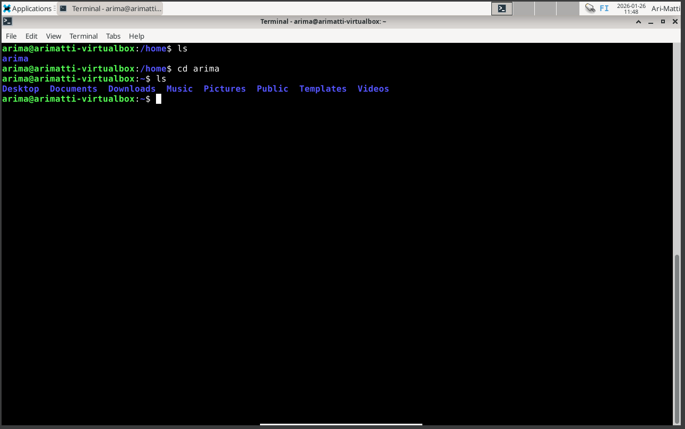

### /etc/
- Tähän kansioon sisältyy kaikki koko koneen asetukset.


- Kaikki tiedostot ovat tekstitiedostoja, voita voimme käsitellä esimerkiksi aijemmin asennetulla Microlla.
- Voimme esimerkiksi avata aikavyöhykeasetukset komennolla:

```micro timezone```

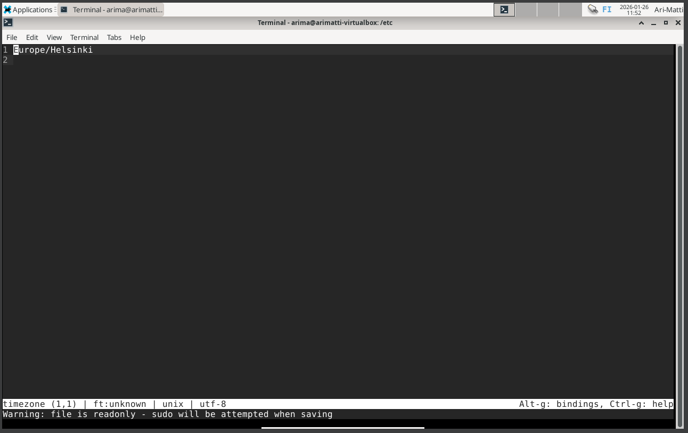

### /media/
- Tässä hakemistossa on kaikki irrotettavat tallennuslaitteet. Esimerkiksi: USB-tikut, ulkoiset kiintolevyt, jne.
- Tällä hetkellä linuxiimme ei ole liitetty mitään, joten kansio on tyhjä:

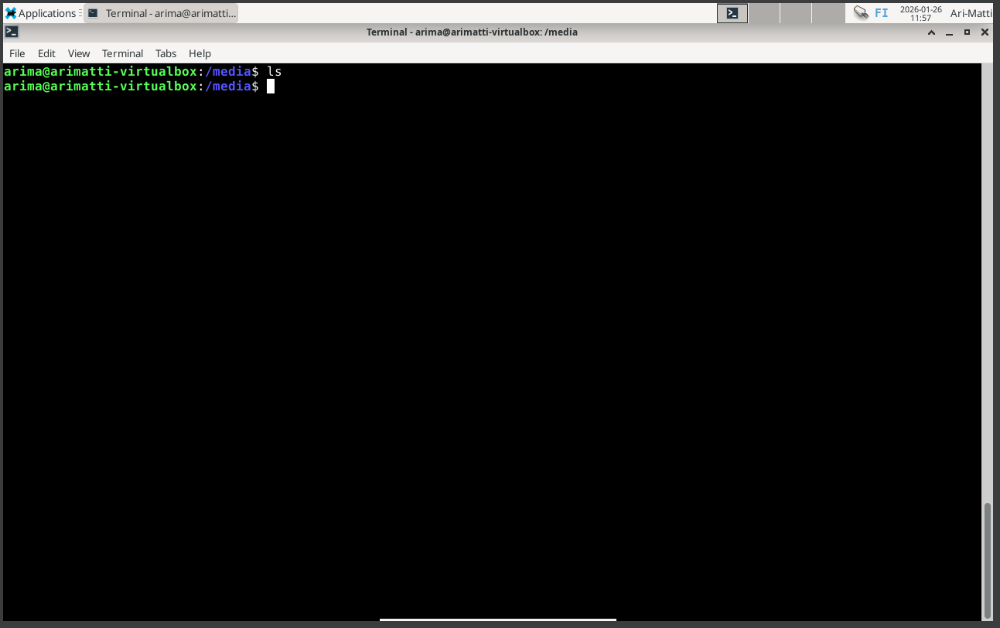

### /var/log/
- Tämän hakemiston alla on järjestelmän lokitiedostot, jotka tallentavat raportteja järjestelmän toiminnasta ja virheistä.

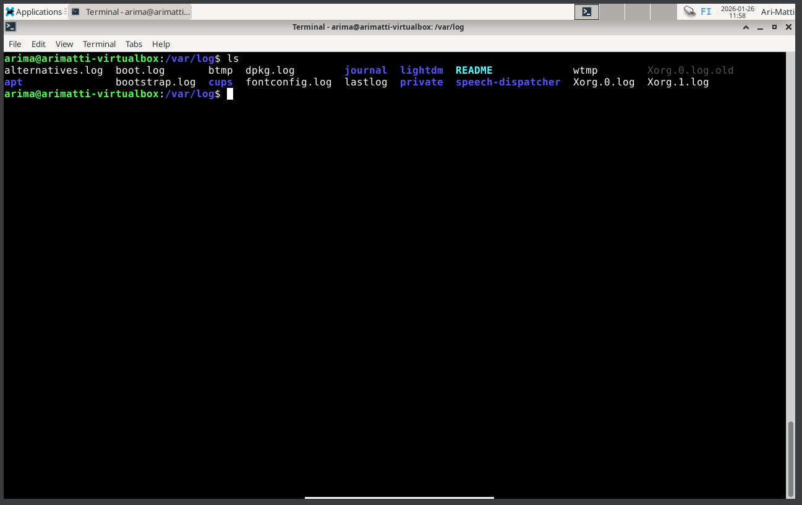

- Voimme tarkastella esimerkiksi viimeisimpiä pakettitapahtumia komennolla

```sudo tail -n 20 /var/log/dpkg.log```

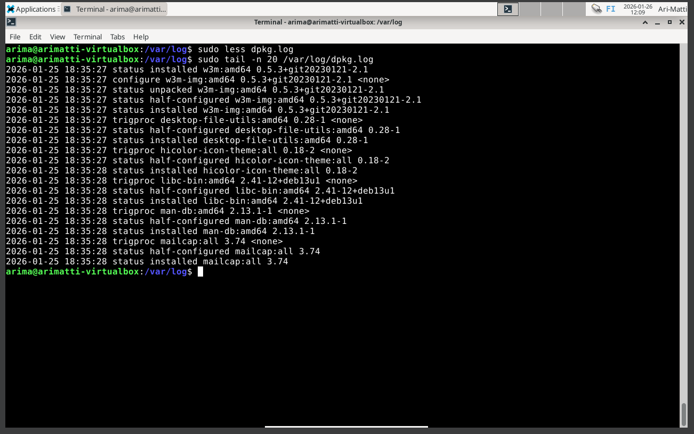

## D - grep
Grep on komento, jolla etsitään tiettyjä sanoja tai tekstipätkiä tekstipohjaisista tiedostoista.

- Voimme jatkaa pakettilogien tutkimista, ja etsiä vain asennettuja paketteja (tai lokeja joissa esiintyy tekstipätkä "install") dpkg.log tiedostosta komennolla:

```sudo grep "install" /var/log/dpkg.log```

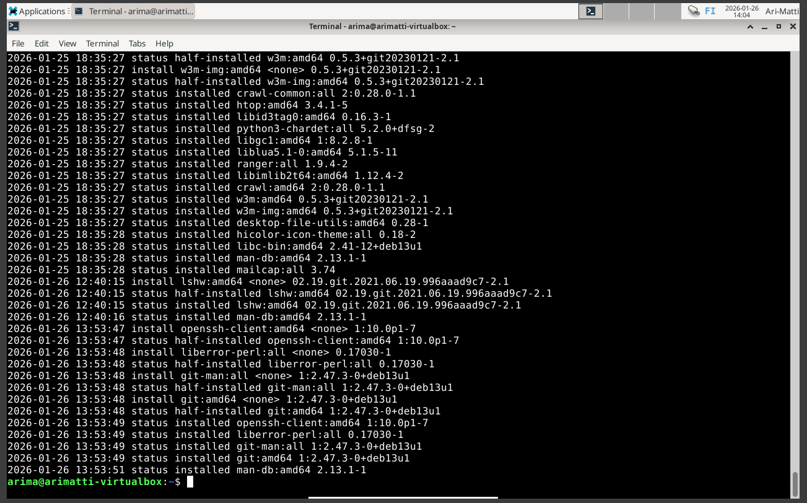

- Komentoon voi myös lisätä optioita. Esimerkiksi voimme etsiä rekursiivisesti kansion kaikista tiedostoista käyttämällä -r komentoa:

```grep -r "unix" ~/Documents/```

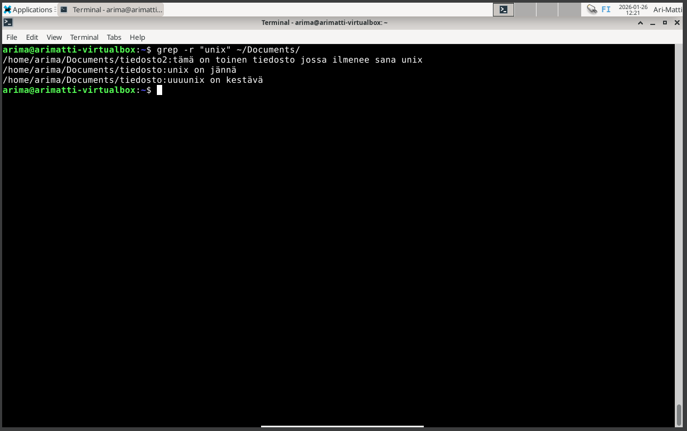

- Hakua voi myös muuntaa optioilla, esimerkiksi tekemällä siitä 'case insensitive' optiolla -i, eli haku ei välitä kirjainkoosta:

```grep -i "UNix" ~/Documents/tiedosto```

## E - Putki
Putken ("|") avulla voimme ketjuttaa komentoja, eli ohjata yhden komennon tulosteen toisen komennon syötteeksi.

- Esimerkiksi, jos haluamme lukumäärän /Documents/ kansion tiedostoista, voimme tehdä komennon:

```ls | w -l```

- Tällöin ls listaa kansion tiedostot, ja wc (word count) saa -l lipun, jolloin tulostaa syötteen rivimäärän, mikä tässä tapauksessa on sama kuin tiedostojen määrä.

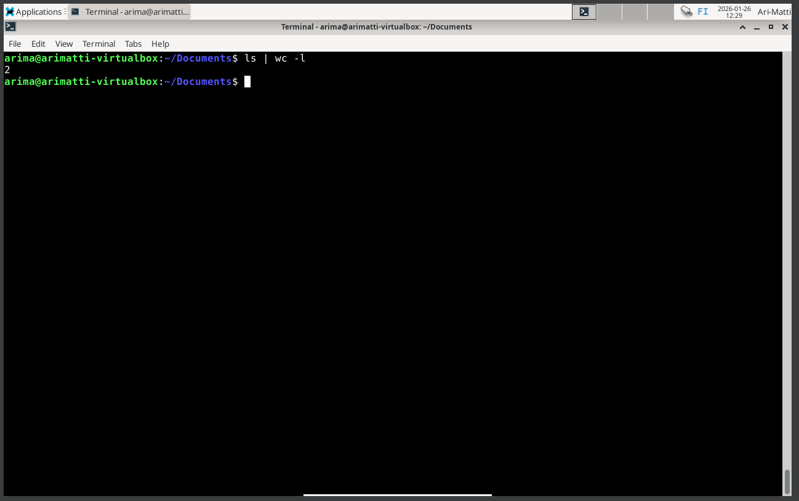

- Putkea voi myös käyttää edellämainitun grep-komennon kanssa. Tässä etsimme /usr/bin kansiosta python-tiedostot:

```ls /usr/bin | grep "python"```

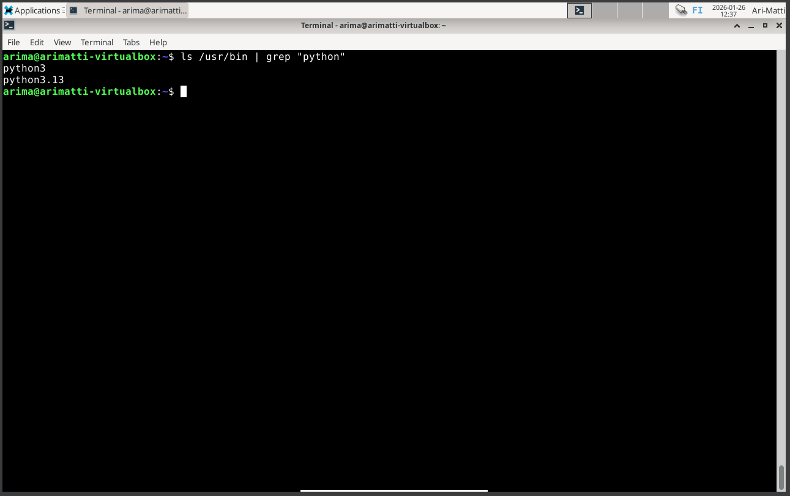

## F - Rauta
lshw komento näyttää seuraavat tiedot laitteistosta:

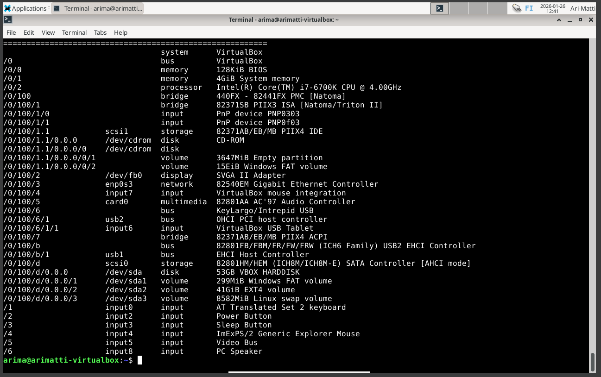

### Selitys & analyysi
**Prosessori & muisti**
- processor: Intel(R) Core(TM) i7-6700K CPU @ 4.00GHz
  - Tämä on host-koneen CPU
- memory: 4GiB System memory
  - Tämän verran virtuaalikoneelle on annettu RAM-muistia

**Kovalevy & partitiot**
- /dev/sda disk: 53GB VBOX HARDDISK
  - 53 GB kovalevytilaa, mikä on allokoitu virtuaalikoneelle host-koneelta
- volume: 41GiB EXT4 volume
- volume: 8582MiB Linux swap volume
  - Pääpartitio Debian-asennukselle on 41 GB, ja virtuaalimuistia on 8.5 GB

**Verkko & muut laitteet**
- network: 82540EM Gigabit Ethernet Controller
  - Verkkoadapteri virtuaalikoneelle
- multimedia: 82801AA AC'97 Audio Controller
  - Äänikortti
- input: VirtualBox mouse/USB Tablet
  - VirtualBox input-laitteet (hiiri ja näppäimistö

## G - Lokianalyysi
Katsomme järjestelmälokista viimeiset 20 riviä komennolla:

```sudo journalctl -n 20```


Jokainen rivi sisältää saman formaatin: Päivämäärä, aika, kone, prosessi: viesti

**Rivi 1-2**
- fstrim-palvelu on suoritettu ja sammutettu.

**Rivit 3-5**
- CRON avasi istunnon root-käyttäjälle, suoritti komennon (anacronin käynnistys), ja sulki istunnon.

**Rivit 6-8**
- Anacron käynnistyi, tarkisti ajettavia tehtviä, ja sulkeutui. Anacronilla ei ollut tehtäviä suoritettavana (0 jobs)

**Rivit 10-12**
- Käyttäjä arima suoritti sudo apt-get komennon.
- Tämä näyttää sen, kun asensin lshwin edellistä tehtävää varten.

**Rivit 14-15**
- Käyttäjä arima ajoi lshw komennon (laitteistolistaus edellisessä tehtävässä)

**Rivi 18**
- Käyttäjä arima ajoi journalctl komennon, tämä on se komento jota juuri katsomme.

## H - Micro plugin
Asennamme Micro tekstieditorille cheat-pluginin. Plugin ladataan ja asennetaan seuraavalla komennolla:

```micro -plugin install cheat```

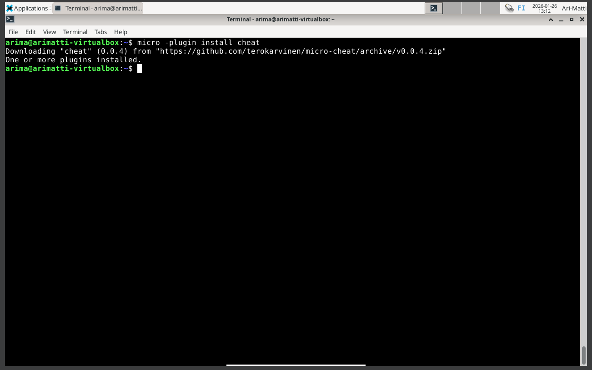

- **Ongelma:** Käynnistämme Micron uudelleen, mutta saimme seuraavan virheen:

```main line:26(column:33) near '\.': Invalide escape sequence```

- Micro kuitenkin avautuu tämän jälkeen, joten tämä ei ole täysin katastrofaalinen ongelma. Haluamme kuitenkin tästä eroon.
- Googletuksen avulla löysin Reddit-ketjun jossa käyttäjä kokee samaa ongelmaa.
- Avuliaasti reddit-ketjussa on myös korjaus ongelmaan
- Ensin avaamme pluginin main.lua tiedoston seuraavalla komennolla

```micro ~/.config/micro/plug/cheat/main.lua```

- Navigoimme riville 26, josta virhe löytyy. Ongelma on, että \. tarvitsee kaksi backslashia. Muutamme siis "\.org$" -> "\\.org$"

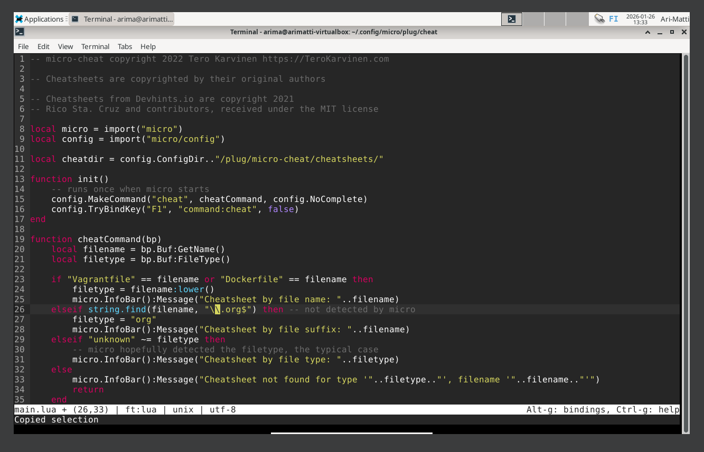

- Nyt Micro toimii moitteettomasti, ja voimme kokeilla pluginia.
- Koska meillä on jo .lua tiedosti sopivasti käsittelyssä, kokeilemme cheatin toimintaa sen omassa main.lua tiedostossa.
- Avaamme siis main.lua tiedoston, ja painamme F1
- **Ongelma:** cheatsheet näyttäisi olevan tyhjä

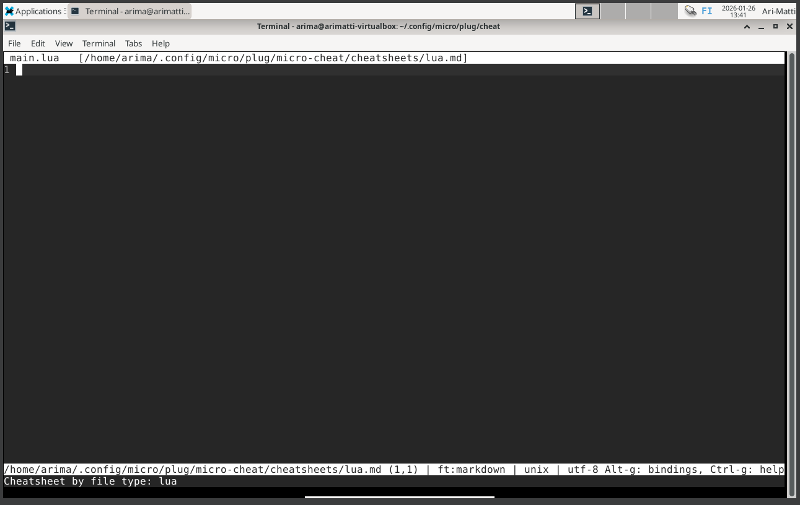

- Vaikuttaa siltä, että pluginin lataus epäonnistui. Koetetaan uudestaan:

```
micro -plugin remove cheat
micro -plugin install cheat
```

- Ja avataan testitiedosto Microlla:

```micro test.lua```

- **Ongelma:** Saamme jälleen saman virheen riviltä 26 puuttuvasta backslashista.
- Korjasimme ongelman samoin kuin yllä.
- Kokeilemme avata main.lua ja tarkastella cheatsheettiä.
- Se on jälleen tyhjä.

- **Seuraava ratkaisuyritys:** Koetamme poistaa plugini ja ladata sen suoraan githubista. Ohjeet tähän löytyvät cheatin githubista.

```
micro -plugin remove cheat
cd ~/.config/micro/plug/
git clone https://github.com/terokarvinen/micro-cheat
```

- Nyt kokeilemme cheattia tekemällä väliaikaisen python tiedoston ja koettamalla avata sen cheatsheetin

```
cd ~
micro test.python
```

- Painamalla F1 Pythonin cheatsheet avautuu oikein.

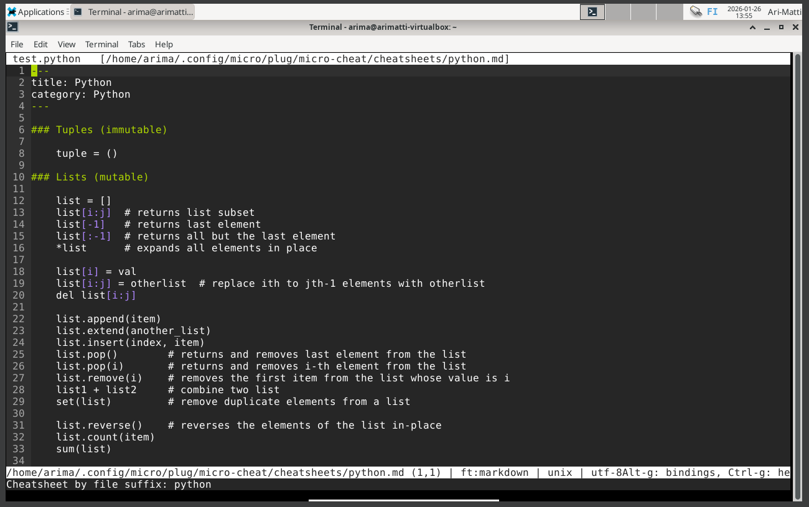

- Testataksemme vielä aijemmin epäonnistunutta tapausta, navigoimme takaisin cheatin main.lua -tiedostoon ja kokeilemme pluginia siellä.
- Täällä näemme oleellisen eron apt-getin kautta haettuun pluginiin riveillä 39-43:

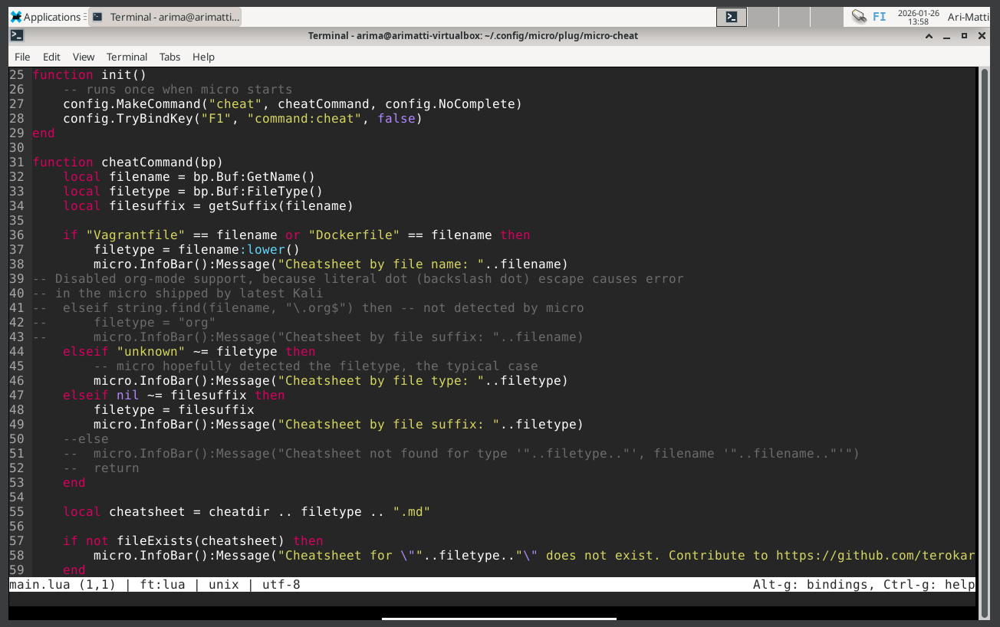

- Häiriöitä tuottanut koodipätkä on kommentoitu pois. Versiot eivät siis ole samat.
- Täällä myös lua cheatsheet toimii oikein:

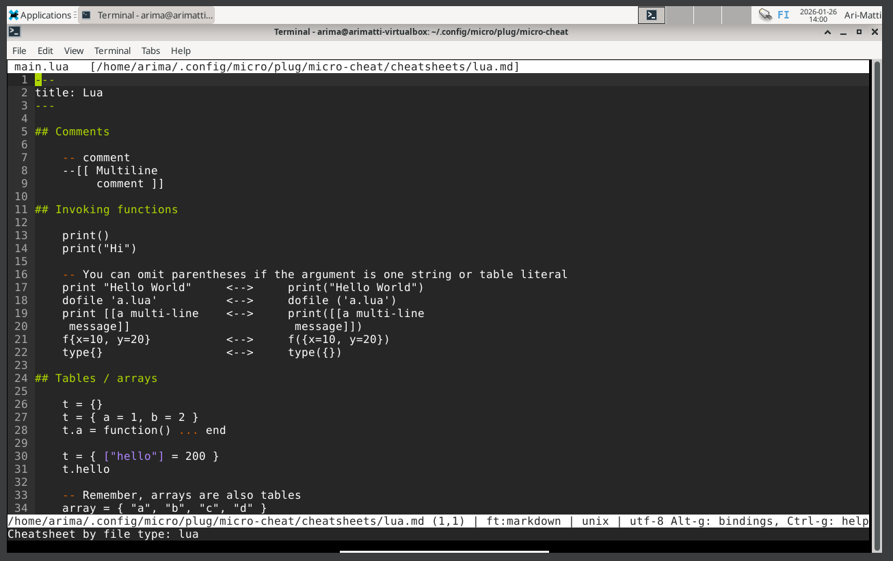

# Lähteet

- https://docs.xfce.org/apps/xfce4-terminal/preferences
- https://terokarvinen.com/2020/command-line-basics-revisited
- https://www.geeksforgeeks.org/linux-unix/grep-command-in-unixlinux/
- https://www.digitalocean.com/community/tutorials/linux-commands
- https://man7.org/linux/man-pages/man8/fstrim.8.html
- https://en.wikipedia.org/wiki/Cron
- https://www.geeksforgeeks.org/linux-unix/anacron-command-in-linux-with-examples/
- https://github.com/terokarvinen/micro-cheat
