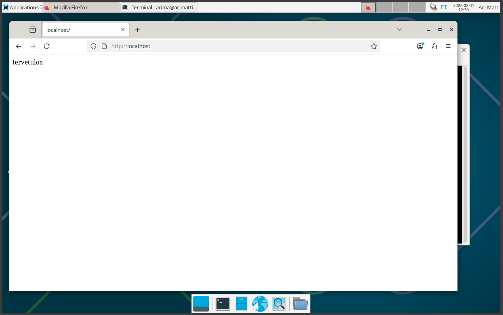
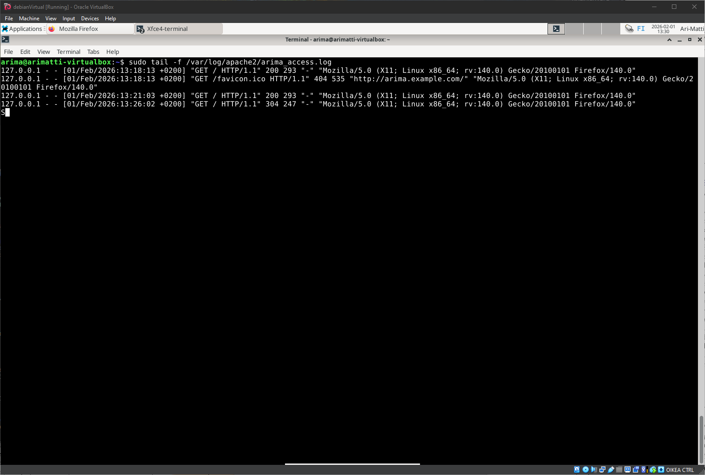
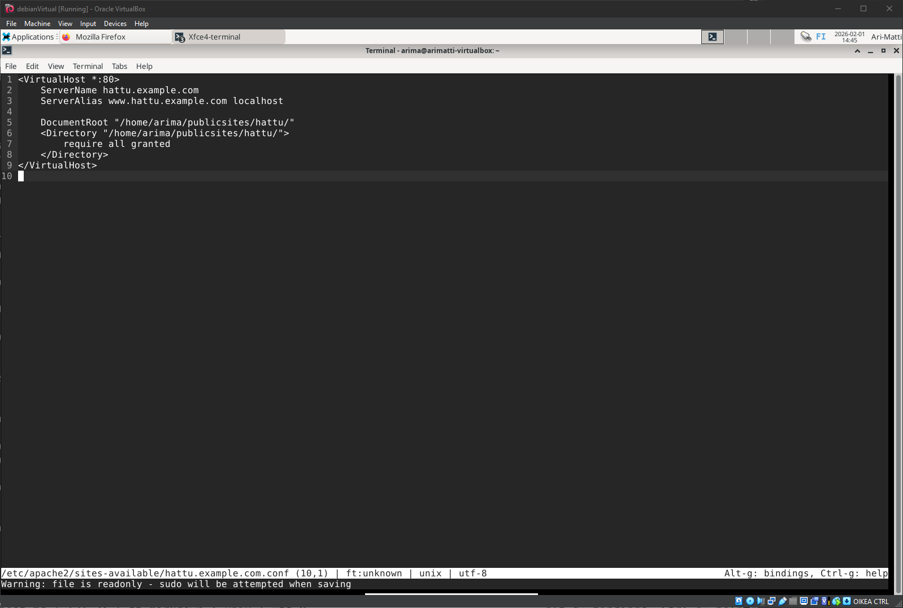
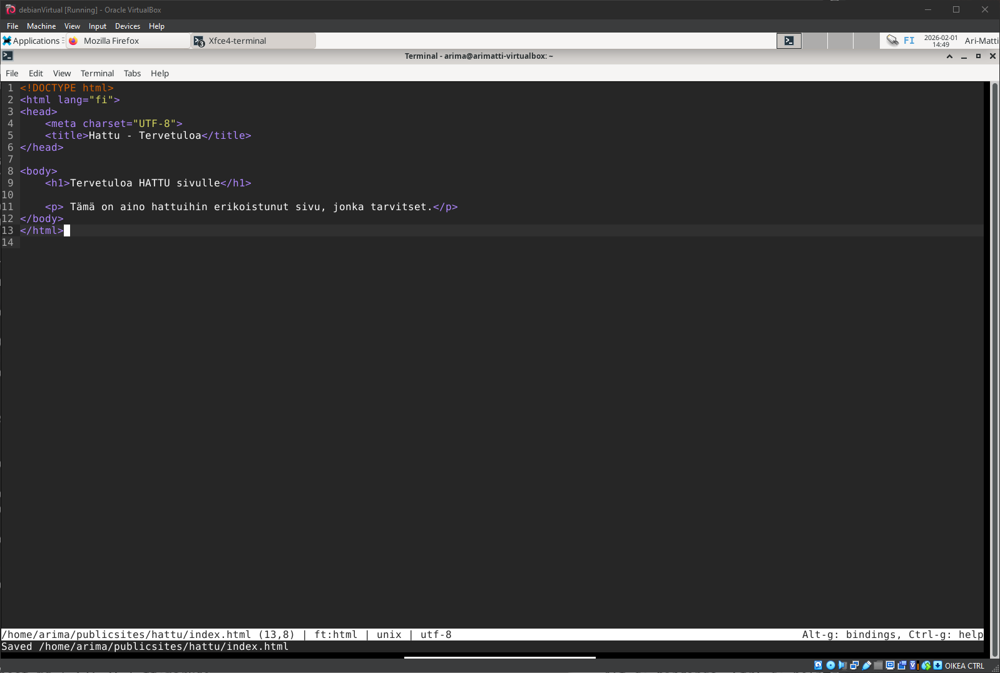
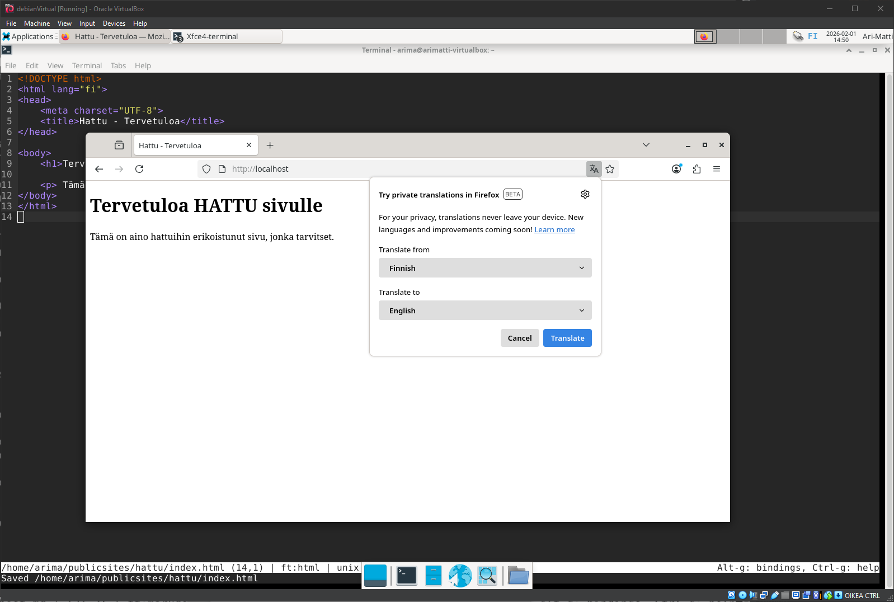
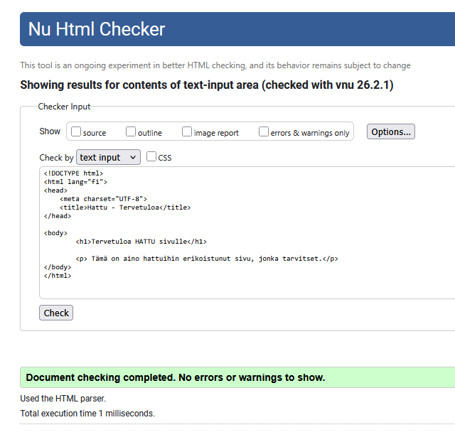
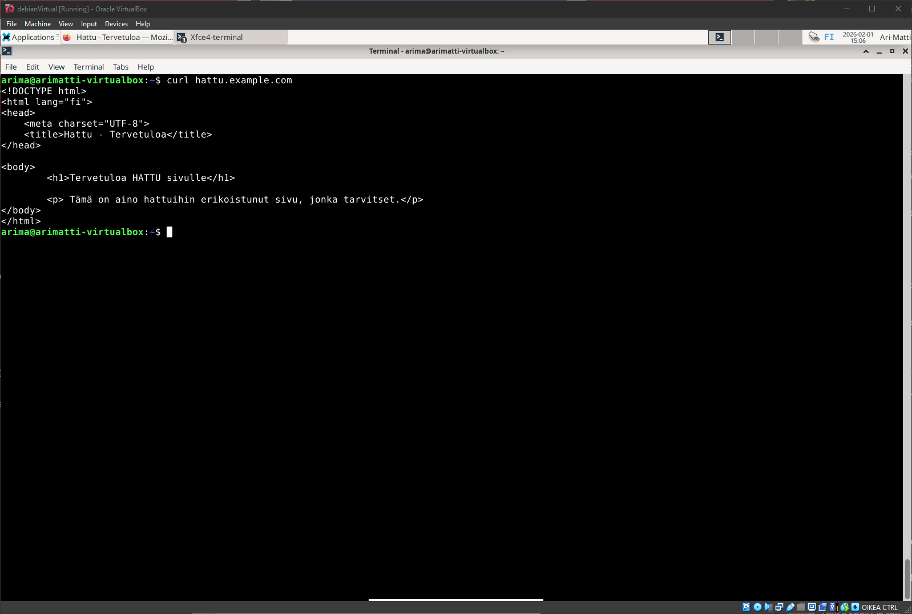
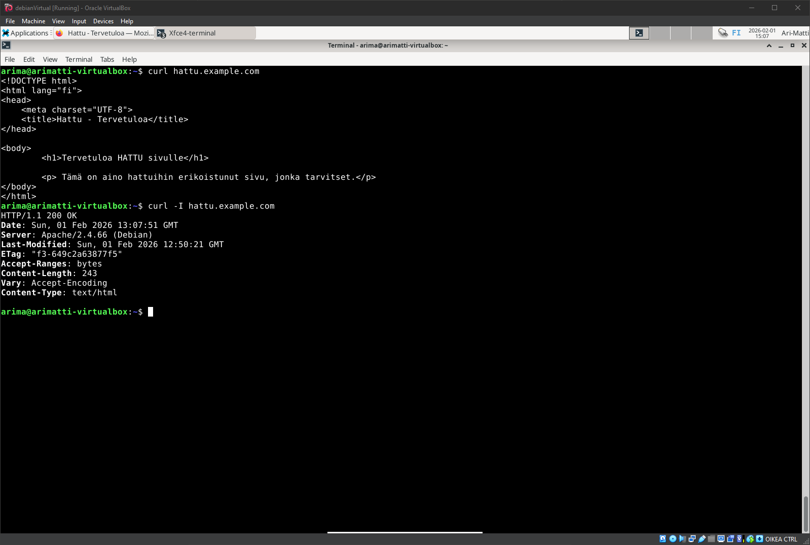

# H3 - Hello Web Server

## Käyttöympäristön tiedot
Tätä tehtävää suoritetaan käyttäen VirtualBoxia. Host-tietokoneena toimii pöytätietokone:

    Processor Intel(R) Core(TM) i7-6700K CPU @ 4.00GHz 4.00 GHz
    Installed RAM 16,0 GB
    Graphics Card NVIDIA GeForce RTX 3080 (10 GB)

## A - Webbipalvelimen vastaus
Webbipalvelin asennettiin tunnin aikana. Tunnilla asensimme Apache2:n ja asetimme uuden etusivun käyttäjähakemistoon. Tässä tehtävässä testaan, että tunnilla asennettu web palvelin toimii ja vastaa localhost -osoitteeseen.



- Palvelin vastaa onnistuneesti, ja näyttää muutetun etusivun.

## B - Loki
Seuraavaksi tarkastelen lokeja, jotka syntyvät kun sivun lataa. Tämän saa tehtyä helposti seuraavalla komennolla:

    sudo tail -f /var/log/apache2/arima_access.log

- arima_access.log on sivulleni konfiguroitu lokitiedosto, joka esittää kaikki HTTP-pyynnöt
- -f -lippu mahdollistaa sen, että uudet rivit tulostuvat heti kun ne syntyvät (kun uusia HTTP-pyyntöjä tehdään palvelimelle)



Tästä voidaan ottaa ensimäinen rivi, joka kertoo sivun latauksesta tapahtuneesta lokitapahtumasta:

    127.0.0.1 - - [01/Feb/2026:13:18:13 +0200] "GET / HTTP/1.1" 200 293 "-" "Mozilla/5.0 (X11; Linux x86_64; rv:140.0) Gecko/20100101 Firefox/140.0"

- 127.0.0.1 - Asiakkaan IP-osoite
- [01/Feb/2026:13:18:13 +0200] - Aikaleima ja aikavyöhyke (UTC+2, eli Suomen talviaika)
- "GET / HTTP/1.1" - HTTP-pyyntö, GET-metodi, juuripolkuun/etusivuun
-  200 - HTTP-tilakoodi. 200 tarkoittaa, että pyyntö onnistui.
-  293 - Vastauksen koko tavuina
-  "Mozilla/5.0..." - Kertoo käyttäjän selaimen ja käyttöjärjestelmän.

On huomioitava, että lokeissa näkyvä Favicon-pyynto sai 404 virheen. Tässä selain yrittää hakea sivukuvaketta, mutta sitä ei ole olemassa.
Lokeissa näkyvä 304 vastaus tarkoittaa, että selain kysyy onko sivu muuttunut, ja palvelin vastasi "ei ole", jolloin selain käyttää välimuistiaan sivun esittämisessä.

## C - Uusi virtuaalihosti
Tässä tehtävässä otan vanhan virtuaalihostin pois käytöstä, ja teen uuden tilalle. Uusi sivu on hattu.example.com, ja tämän pitää näkyä: asetustiedoston nimessä, asetustiedoston ServerName-muuttujassa sekä etusivun sisällössä (esim title, h1 tai p).

- Ensin tehdään uusi sivu komennolla:

```
sudoedit /etc/apache2/sites-available/hattu.example.com.conf
```

- Tiedostoon laitamme sivun konfiguraatiot:



- Seuraavaksi poistamme vanhan sivun käytöstä, ja laitamme uuden tilalle:

```
sudo a2dissite arima.conf
sudo a2ensite hattu.example.com.conf
```

- Tämän jälkeen käynnistämme serverin uudelleen:

```
sudo systemctl restart apache2
```

- Sitten teemme hattu-kansion, sinne index tiedoston ja siihen sivun yksinkertaisen html-koodin:

```
mkdir /home/arima/publicsites/hattu
micro /home/arima/publicsites/hattu/index.html
```


- Navigoidessa sivu näkyy, mutta mukana on myös esteettinen ongelma: Ääkköset eivät näy oikein.


- Korjaamme tämän seuraavassa tehtävässä.

## E - HTML5 sivu
Tässä tehtävässä teemme validin HTML5 sivun.
- Jotta ääkköset näkyisi, index.html tiedostoon pitää lisätä UTF-8 meta-tagi. Formatoin sen muutenkin paremmaksi:



- Sivu näyttää ääkköset nyt oikein, ja Firefoxikin tunnistaa, että sivu on suomenkielinen.



- Myös HTML validaattorisivu https://validator.w3.org/nu näyttää sivun olevan validi:



## F - Curl
Tässä osiossa selitän ja demonstroin curl komentoa.

- curl komento näyttää sivun sisällön. Esimerkkinä komento:

```
curl hattu.example.com
```

- Tulostaa juuri tekemäni html-sisällön:



- curl -I puolestaan näyttää vain HTTP-headerit:



Headerien selitykset:

| Header | Selitys |
|--------|---------|
| **HTTP/1.1 200 OK** | Statuskoodi: 200 = pyyntö onnistui.|
| **Date** | Milloin palvelin lähetti vastauksen |
| **Server** | Palvelinohjelmisto ja versio (Apache 2.4.66 Debian) |
| **Last-Modified** | Milloin tiedostoa viimeksi muokattiin |
| **ETag** | Tunniste tiedostolle, joka auttaa välimuistia tunnistamaan muutokset |
| **Content-Length** | Vastauksen koko tavuina (243 tavua) |
| **Content-Type** | Sisällön tyyppi (text/html = HTML-sivu) |

## Lähteet:
- https://terokarvinen.com/2018/04/10/name-based-virtual-hosts-on-apache-multiple-websites-to-single-ip-address/
- https://httpd.apache.org/docs/2.4/vhosts/name-based.html
- https://www.w3schools.com/bash/bash_curl.php
- https://en.wikipedia.org/wiki/HTTP_ETag
