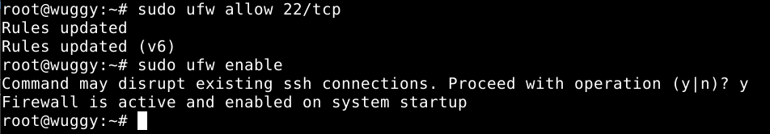
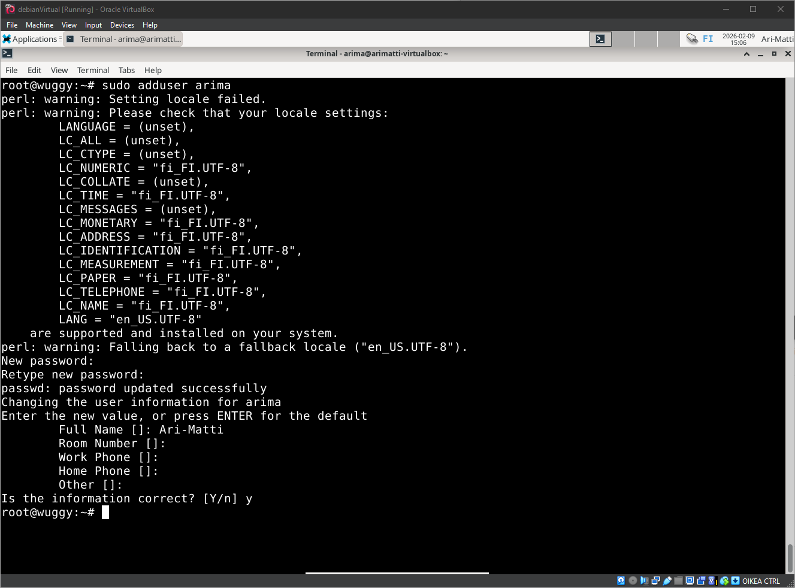
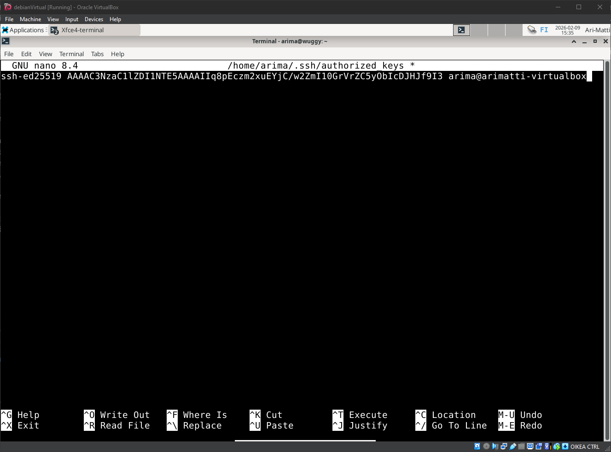
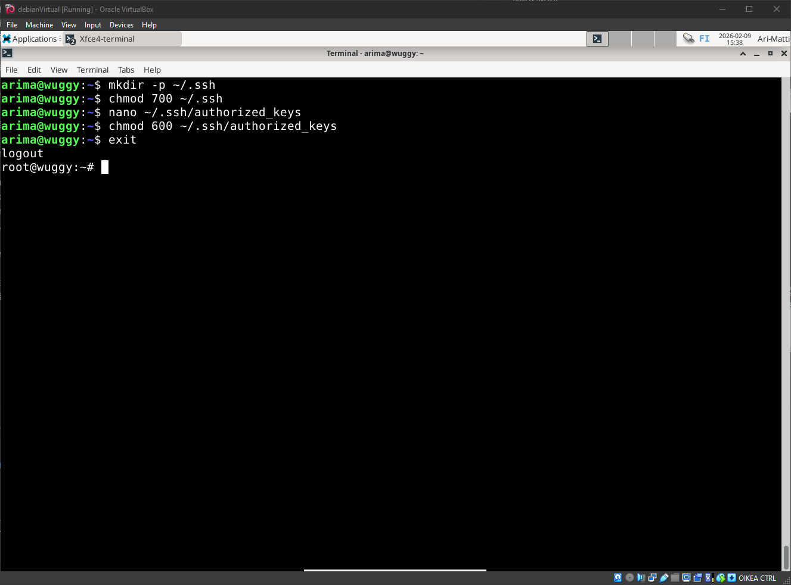
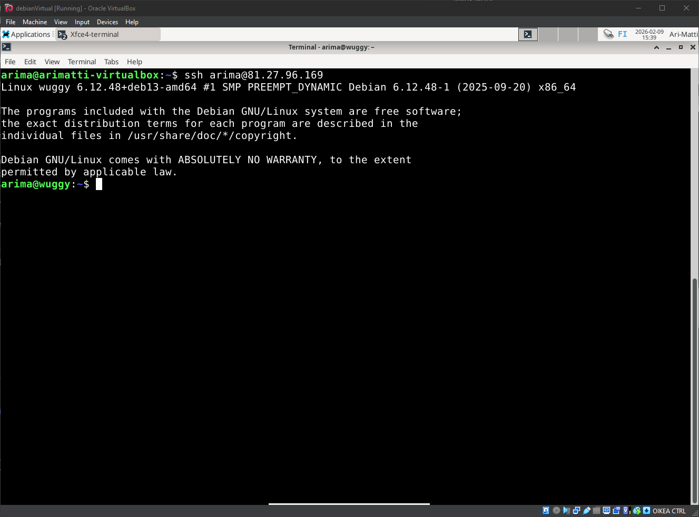
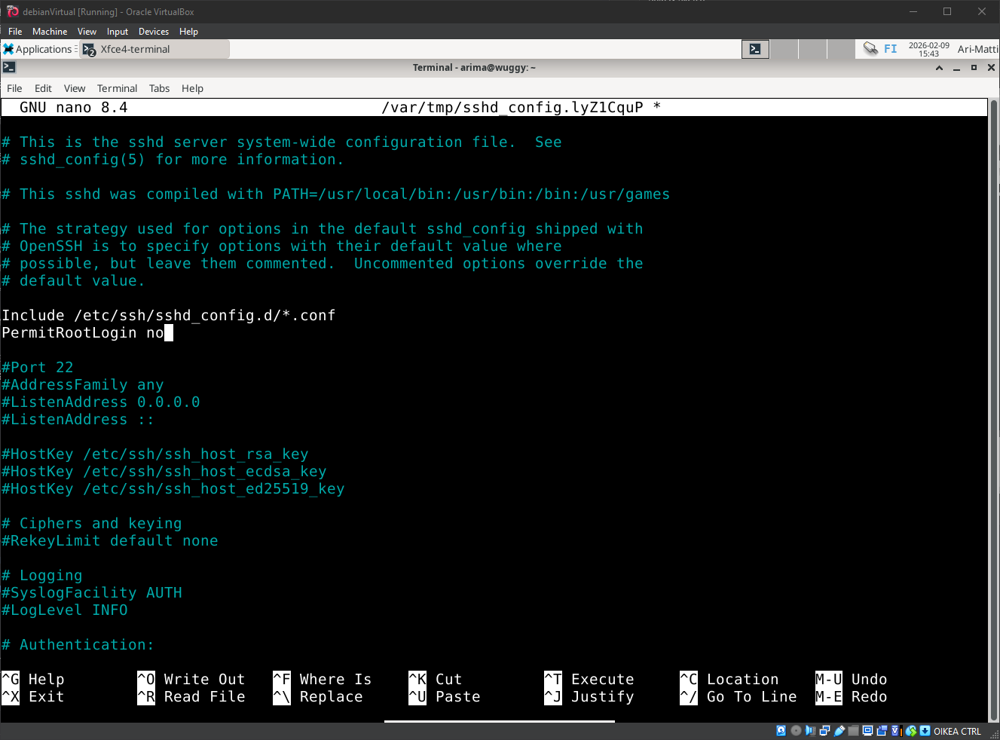
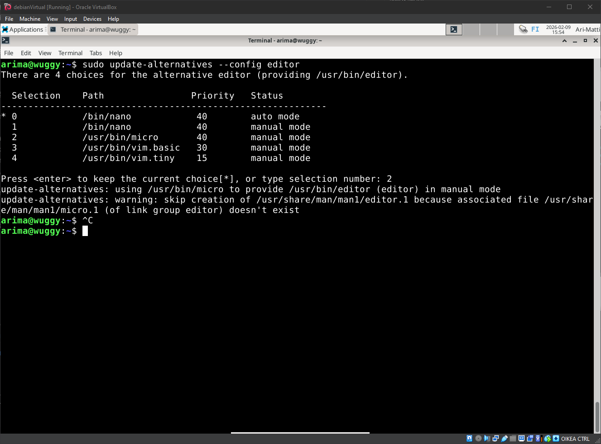
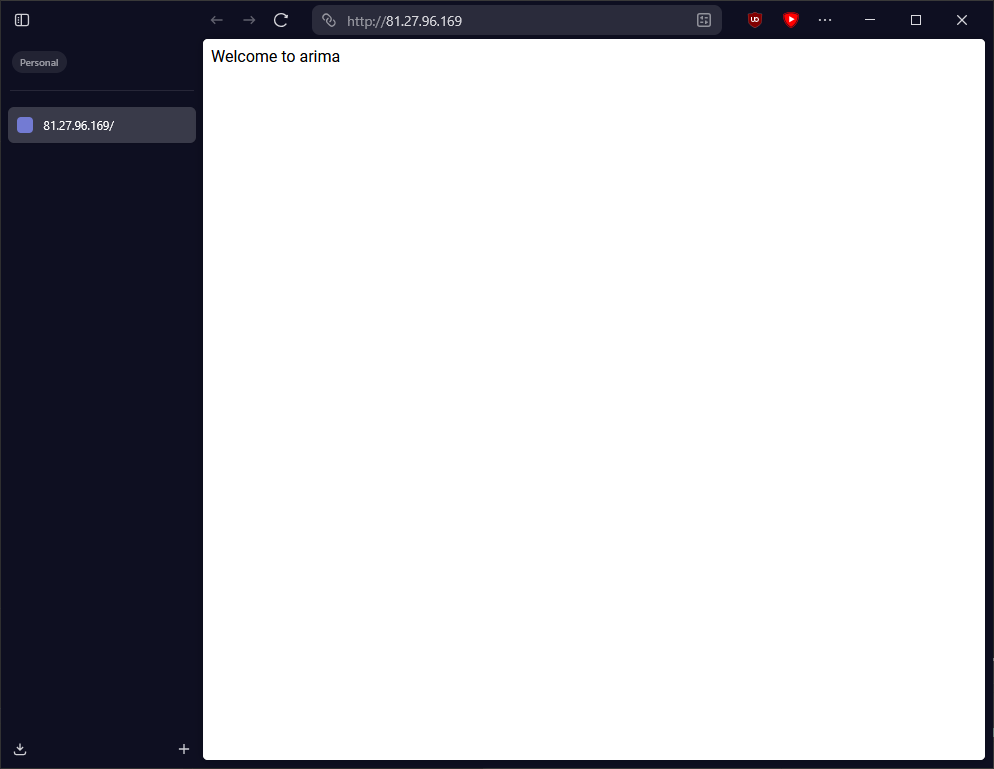

# H4 - Pilvipalvelin

Tehtävän tarkoituksena on laittaa pystyyn pilvipalvelinn ja dokumentoida prosessi. Tehtävä osittain tapahtui jo tunnilla.

## Käyttöympäristön tiedot
Tätä tehtävää suoritetaan käyttäen VirtualBoxia. Host-tietokoneena toimii pöytätietokone:

    Processor Intel(R) Core(TM) i7-6700K CPU @ 4.00GHz 4.00 GHz
    Installed RAM 16,0 GB
    Graphics Card NVIDIA GeForce RTX 3080 (10 GB)

## A - Virtuaalipalvelimen vuokraus
Tämä osio tapahtui jo tunnilla. Vuokrasin palvelimen UpCloud palvelusta.

## B - Alkutoimet
Tässä osiossa teen tarvittavat alkutoimet palvelimella: palomuurin asennuksen, root-tunnuksen kiinnilaiton ja päivitykset.

### Palomuuri

- Otimme SSH yhteyden palvelimeen, ja ensimmäisenä asennamme palomuurin. Ennen sitä kuitenkin päivitämme paketit:

```
sudo apt-get update
```

- Koska olemme vielä root-käyttäjä, voisimme tehdä komennon ilman sudoa. On kuitenkin hyvä sisällyttää se komentoihin jotta se näkyy lokeissa.
- Seuraavaksi asennamme palomuurin ja laitamme sen päälle:

```
sudo apt-get install ufw
sudo ufw allow 22/tcp
sudo ufw enable
```



- Allow 22/tcp varmistaa, että SSH yhteys toimii palomuurin kanssa. Jotta saamme palomuurin päälle, on palvelin rebootattava:

```
sudo reboot
```

### Käyttäjä

- Ensin luomme käyttäjän, ja annamme tälle vahvan salasanan.

```
sudo adduser arima
```



(Locale-varoitukset ovat ärsyttäviä, mutta eivät estä komentojen ajamista.)

- Seuraavaksi annetaan käyttäjälle tarvittavat oikeudet.

```
sudo adduser arima sudo
sudo adduser arima adm
```

- Jotta saamme yhteyden käyttäjään, laitamme tämän hyväksymään SSH-avaimemme. Ensin vaihdamme arima käyttäjäksi:


```
su - arima
```

- Sitten luomme /.ssh/ kansion

```
mkdir -p ~/.ssh
chmod 700 ~/.ssh
```

- Sitten laitamme public avaimemme authorized-keys kansioon.

```
nano ~/.ssh/authorized_keys
```



- Asetamme oikeudet, ja poistumme käyttäjältä takaisin root-käyttäjäksi

```
chmod 600 ~/.ssh/authorized_keys
exit
```



- Nyt testaamme ottamalla suoran yhteyden arima-käyttäjään



### Root-tunnuksen sulkeminen

- Seuraavaksi lukitsemme root-tunnuksen:

```
sudo usermod --lock root
```

- Sitten poistamme SSH-root yhteyden käytöstä:

```
sudoedit /etc/ssh/sshd_config
```



```
sudoedit service ssh restart
```

### Pakettipäivitys

- On tärkeää pitää paketit ajantasalla.

```
sudo apt-get update
sudo apt-get upgrade
```

- Jotta tekstinkäsittely on mukavampaa, asennamme nanon sijalle micron ja asetamme sen oletustekstityökaluksi:

```
sudo apt-get install micro
sudo update-alternatives --config editor
```



## C - Palvelinasennus

Tehtävänä on asentaa virtuaalipalvelimelle Apache-webpalvelin, korvata testisivu ja tehdä sivu julkisesti näkyväksi.

- Ensin asennamme Apache2 ja teemme sille reitin palomuuriin:

```
sudo apt-get install apache2
sudo ufw allow 80/tcp’
```

- Käymme läpi sivunpystytys-prosedyyrin. Tarkempi selonteko tästä löytyy edellisestä tehtävästä: [Linkki](h3_Hello_Web_Server.md).

```
echo terve | sudo tee /var/www/html/index.html
sudoedit /etc/apache2/sites-available/arima.conf
sudo a2dissite 000-default.conf
sudo a2ensite arima.conf
mkdir publicsites
mkdir publicsites/arima/
micro publicsites/arima/index.html
sudo systemctl restart apache2
```

- Kaikkien näiden operaatioiden jälkeen navigoin serverin IP osoitteeseen toisella koneella. index.html teksti näkyy oikein:



## Lähteet
- https://terokarvinen.com/linux-palvelimet/
- https://susannalehto.fi/2022/teoriasta-kaytantoon-pilvipalvelimen-avulla-h4/
- https://terokarvinen.com/2017/first-steps-on-a-new-virtual-private-server-an-example-on-digitalocean/
- https://unix.stackexchange.com/questions/42726/how-do-i-change-the-default-text-editor-in-the-debian-squeeze-distro
