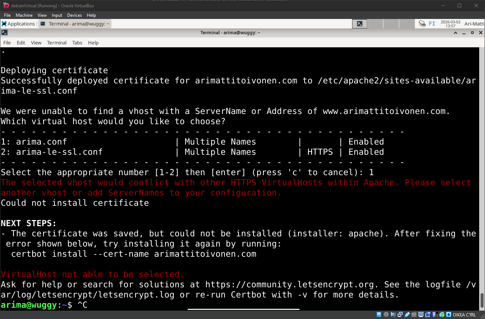
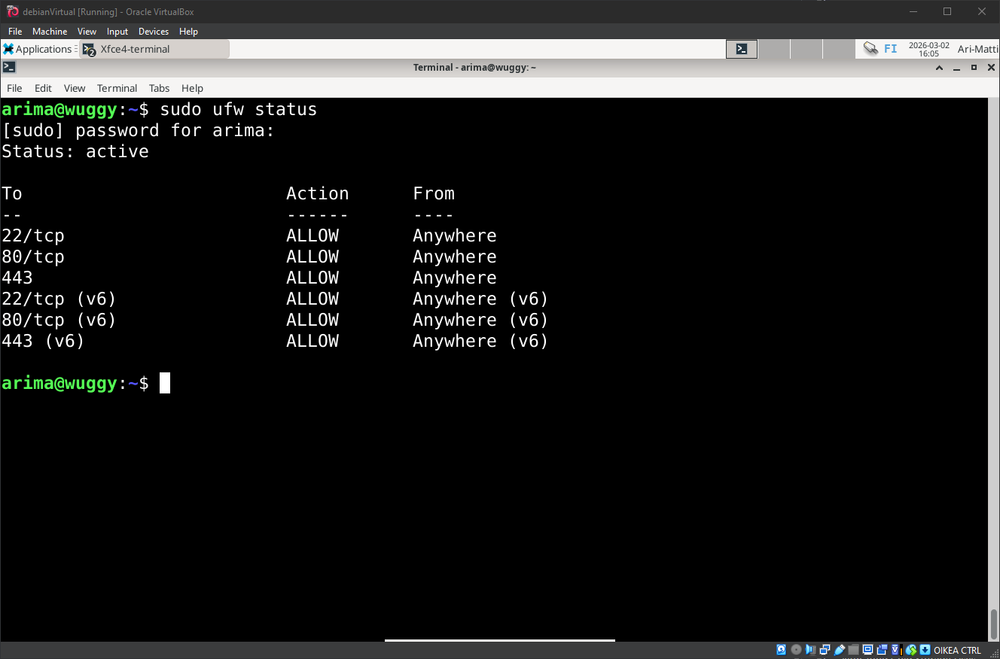
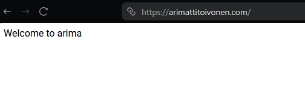
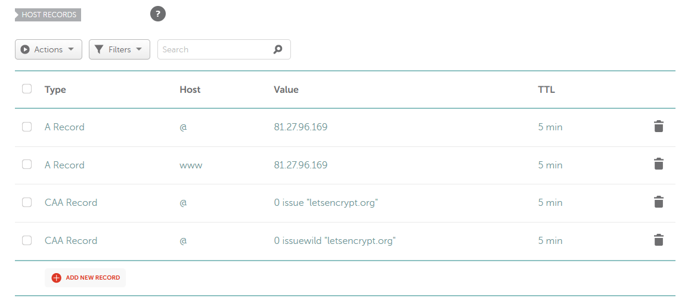
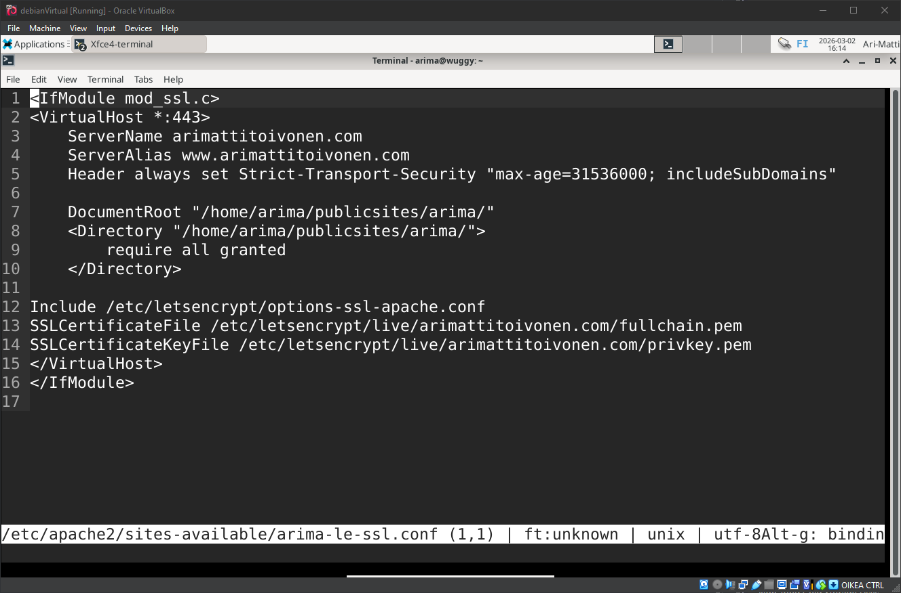
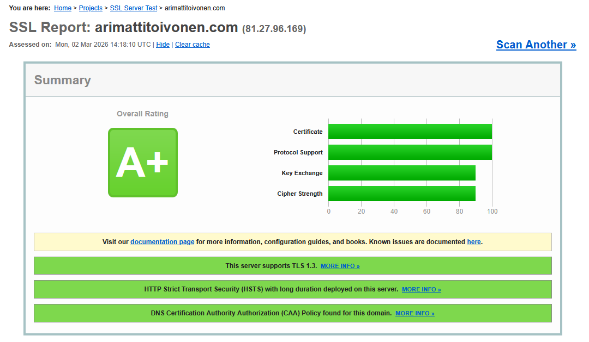

# H6 - Salaus

Tässä tehtävässä suojaamme verkkosivumme HTTPS-yhteydellä.

**HUOMIO!** Tein tehtävän kertaalleen, mutta teknisen virheen takia menetin sekä ottamani screenshotit, että valtaosan kirjoittamastani tekstistä. Iso osa raportista onkin tästä syystä kirjoitettu takautuvasti muistista, ja valitettavasti kuvia prosessin kulusta ei ole. Koetan parhaani mukaan laittaa konsolin palautuksia tekstimuodossa, ja ottaa kuvia uudelleen.

## Käyttöympäristön tiedot
Tätä tehtävää suoritetaan käyttäen VirtualBoxia. Host-tietokoneena toimii pöytätietokone:

    Processor Intel(R) Core(TM) i7-6700K CPU @ 4.00GHz 4.00 GHz
    Installed RAM 16,0 GB
    Graphics Card NVIDIA GeForce RTX 3080 (10 GB)

## X - Let's Encrypt ja Apachen SSL/TLS-kofiguraatio
- Let's Encrypt voi antaa sivulle tarvittavan SSL/TLS-sertifikaatin.
- ACME-asiakas (*Automatic Certificate Management Environment*) todistaa sertifikaattiviranomaiselle, että palvelin hallitsee kyseistä domaini.
- Kun tämä on vahvistettu, asiakas voi pyytää sertifikaatin lähettämällä CSR-pyynnön, jonka viranomainen tarkistaa ja myöntää.

- Sertifikaatti otetaan käyttöön Apache-verkkopalvelimella konfiguraatiotiedostoilla ja direktiiveillä.
- HTTPS otetaan käyttöön, salaus vahvistetaan, sertifikaatin tila tarkistetus aktivoidaan (OCSP Stapling), ja pääsy rajoitetaan asiakassertifikaateilla.

## A - Sertifikaatin hankinta

- Ensitöiksemme otamme SSH-yhteyden palvelimeen, ja asennamme ACME-asiakkaan, Certbotin

```
ssh arima@81.27.96.169
sudo apt-get update
sudo apt-get install certbot
sudo apt-get install python3-certbot-apache
```

- Sitten hankimme ja asennamme sertifikaatin.

```
sudo certbot --apache -d arimattitoivonen.com -d www.arimattitoivonen.com
```



- Vastauksen mukaan sertifikaatti on hankittu oikein, mutta Apache-asennus epäonnistui, koska ServerName / ServerAlias ei ole asetettu oikein.
- Avaamme HTTP-vhostin

```
sudo micro /etc/apache2/sites-available/arima.conf
```

- Täällä näemmekin, että näissä on väärä ServerName ja -Alias, aijemmin testikäytössä ollut "arima.example.com"
- Päivitämme sen vastaamaan todellista domainia:

```
ServerName arimattitoivonen.com
ServerAlias www.arimattitoivonen.com
```

- Testaamme vielä että sivu toimii:

```
sudo apache2ctl configtest
```

- "Syntax OK" eli onnistui.
- Sitten vielä käynnistämme serverin uudestaan ja asennamme sertifikaatin uudelleen.

```
sudo systemctl reload apache2
sudo certbot install --cert-name arimattitoivonen.com
```

- Vastaus ei valittanut konflikteista, joten asennus meni onnistuneesti.
- Lisäämme vielä HTTP-vhostiin automaattisen HTTPS-ohjauksen:

```
sudo nano /etc/apache2/sites-available/arima.conf
```

- Sisältöön laitamme:

```
Redirect permanent / https://arimattitoivonen.com/
```

- Ja otamme muutokset käyttöön:

```
sudo apache2ctl configtest
sudo systemctl reload apache2
```

- Testaamme vielä, että uudelleenohjaus toimii:

```
curl -I http://arimattitoivonen.com
curl -I http://www.arimattitoivonen.com
```

- Nämä molemmat palauttivat tarvittavat osat:

```
HTTP/1.1 301 Moved Permanently
Location: https://arimattitoivonen.com/
```

- Tässä vaiheessa törmäämme ongelmaan kun koetamme testata HTTPS yhteyttä selaimella, ja saamme "connection timeout"
- Tämä ei ole certbot-ongelma vaan yhteys ei pääse palvelimelle asti. Todennäköisin syypää on palomuuri.
- Katsomme, mitkä portit ovat auki palomuurissa:

```
sudo ufw status
```

- Palaute kertoo, että portt 80 on auki, mutta tarvitsemamme portti 443 ei ole.
- Korjaamme tämän ajamalla:

```
sudo ufw allow 443
```



- Nyt setkä 80, että 443 portti on auki. Testaamme sivun toimivuutta selaimella:



# B - SSL Testi
Tässä tehtävässä testaamme sivujen TLS:n käyttämäällä SSLLabs laadunvarmistustyökalua.

- Alkuperäinen arvosanamme oli **A**, mikä tarkoittaa että sivut ovat hyvällä tasolla.
- Testissä tuli kuitenkin kaksi huomioitavaa kohtaa ilmi:

```
DNS CAA: No
```

- Tämä tarkoittaa, että sivulle ei ole asetettu CAA-tietuetta, joka kertoo mikä varmentaja voi myöntää sertifikaatteja domainille.
- Korjaamme tämän lisäämällä Namecheapin puolella CAA tietueet:



- Toinen huomioitava osa oli:

```
HSTS: No
```

- Tämä on HTTP Strict Transport Security, joka estää HTTP-yhteydet kokonaan.
- Tämän saamme päälle lisäämällä HTTPS-vhostiin headerin:



- Ja ajamalla komennon:

```
sudo a2enmod headers
sudo systemctl reload apache2
```

- Näiden muutosten jälkeen SSLLabs arvosanamme on noussut **A+**.



# Lähteet
- https://certbot.eff.org/instruction
- https://httpd.apache.org/docs/2.4/ssl/ssl_howto.html#configexample
- https://letsencrypt.org/docs/caa/
- https://blog.qualys.com/product-tech/2017/03/13/caa-mandated-by-cabrowser-forum
