# H7 - Maalisuora

## Käyttöympäristön tiedot
Tätä tehtävää suoritetaan käyttäen VirtualBoxia. Host-tietokoneena toimii pöytätietokone:

    Processor Intel(R) Core(TM) i7-6700K CPU @ 4.00GHz 4.00 GHz
    Installed RAM 16,0 GB
    Graphics Card NVIDIA GeForce RTX 3080 (10 GB)

## A - Hello World
Tässä tehtävässä kirjoitamme ja ajamme "Hello World" ohjelman kolmella eri ohjelmointikielellä. Valitsin ohjelmointikieliksi Python 3, Lua ja Bash.

### Python 3

- Ensin katsomme onko Python 3 asennettuna koneessa kokeilemalla komentoa

```
python3 --version
```

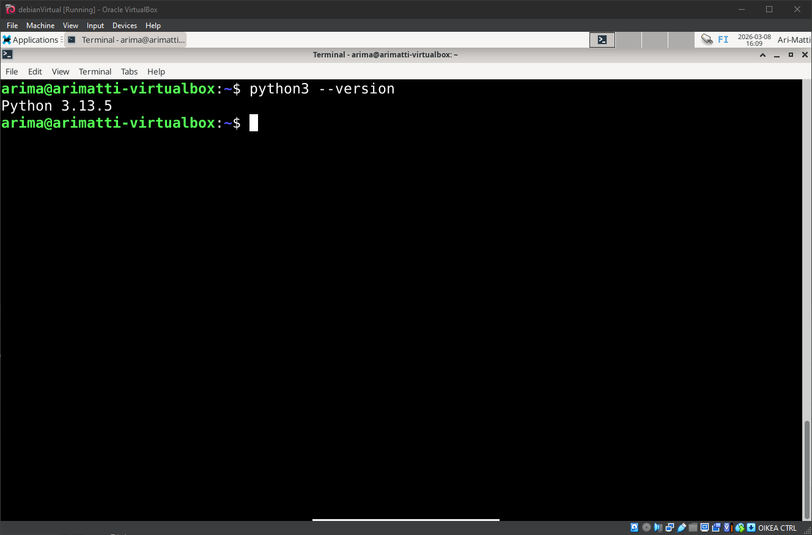

- Python on asennettuna koneeseen, joten voimme jatkaa kirjoittamaan ohjelmaa.
- Luomme uuden python tiedoston, ja kirjoitamme yksinkertaisen Hellow World ohjelman siihen.

```
micro helloworld.py
```

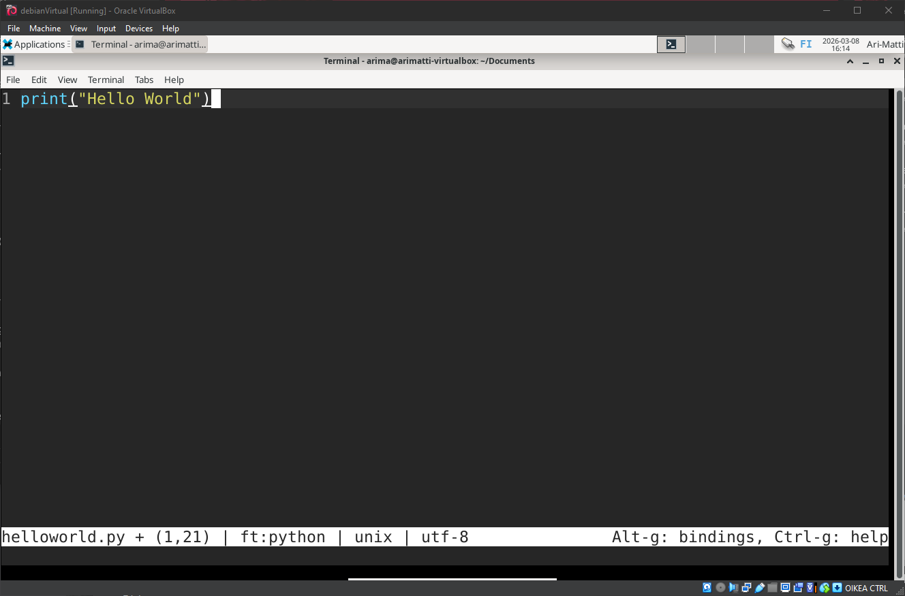

- Tallennuksen jälkeen ajetaan ohjelma:

```
python3 helloworld.py
```


### Lua

- Ensin asennamme Luan pakettimanagerista.

```
sudo apt-get install lua5.4
```

- Ja teemme lähes identtisen prosessin läpi:

```
micro helloworld.lua
```

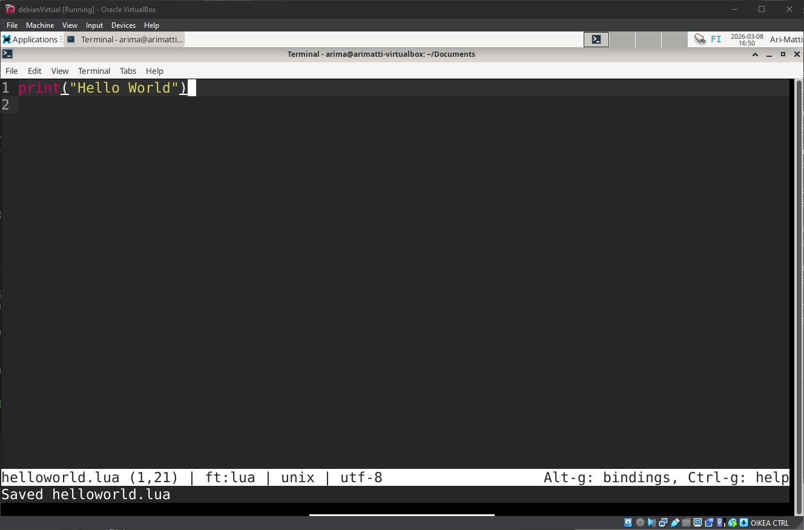

```
lua helloworld.lua
```


### Bash

- Bashia ei luonnollisesti tarvitse erikseen asentaa.
- Käymme saman prosessin läpi.

```
micro helloworld.sh
```

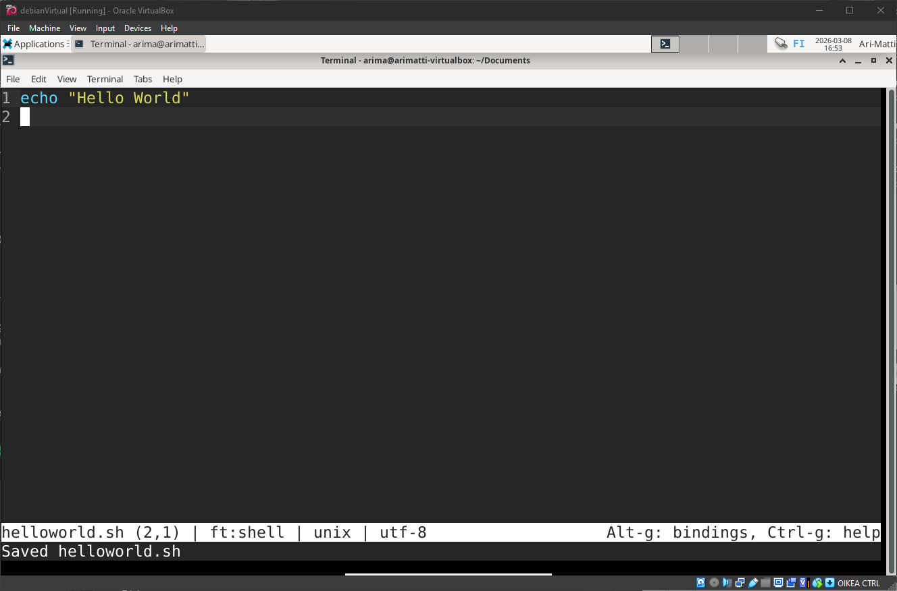

```
bash helloworld.sh
```

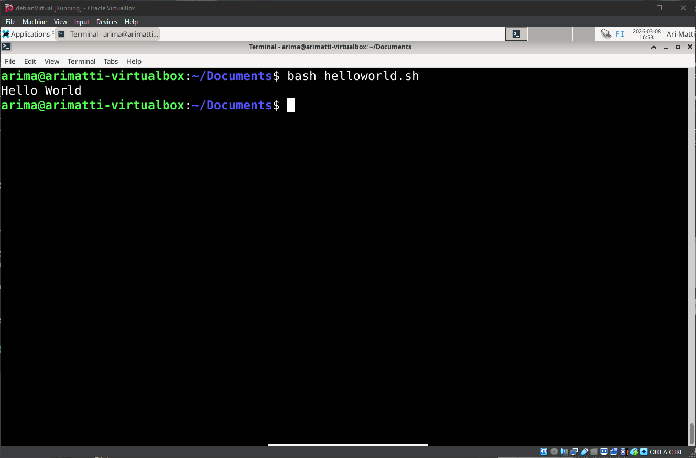

## B - Tehtävien tarkastus
Tässä tehtävässä vain tarkastan kurssin aijemmat tehtävät, ja lisään mahdollisesti puuttuvat lähdeviitteet tms. Alla on linkki kaikkiin aijempiin raportteihin:

- [h1_oma_linux](h1_oma_linux.md)
- [h2_CMD](h2_CMD.md)
- [h3_hello_web_server](h3_Hello_Web_Server.md)
- [h4_pilvipalvelin](h4_pilvipalvelin.md)
- [h5_nimi](H5_nimi.md)
- [h6_salaus](h6_salaus.md)

## C - Shell skripti
Tässä tehtävässä luomme shell skriptin ja teemme siitä ajettavan kaikille käyttäjille.

- Luomme ensin skriptin

```
micro sysinfo.sh
```

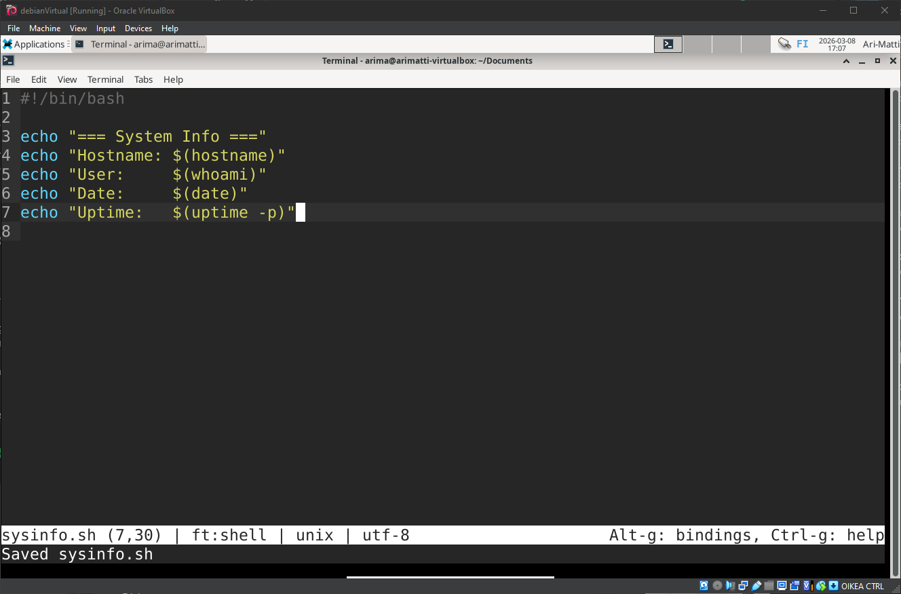

**Selitykset skriptille**

```
#!/bin/bash
```

- Tämä on "Shebang" rivi. Se kertoo, että loppu skripti suoritetaan bashilla, ja osoitta missä se sijaitsee.

```
echo "=== System Info ==="
```

- Tämä printtaa vain tekstiä, koristelun vuoksi.

```
echo "Hostname: $(hostname)"
echo "User:     $(whoami)"
echo "Date:     $(date)"
echo "Uptime:   $(uptime -p)"
```

- Tässä skripti antaa erilaisia tietoja koneesta ajamalla erilaisia komentoja.
- Nämä komennot ovat "$(...)" syntaksin sisällä ja printtaavat komennon tulokset tuohon kohtaan tekstiä. Tätä kutsutaan nimellä "command substitution"
- Varsinaiset komennot ovat:
  - **hostname** - Printtaa koneen verkon hostnimen
  - **whoami** - Printtaa nykyisen käyttäjänimen
  - **date** - Printtaa päiväyksen
  - **uptime -p** - Printtaa kuinka kauan systeemi on ollut päällä. *-p* lippu tekee printistä luettavamman.

- Kun skriptin ajaa, palautus näyttää tältä:

```
bash sysinfo.sh
```

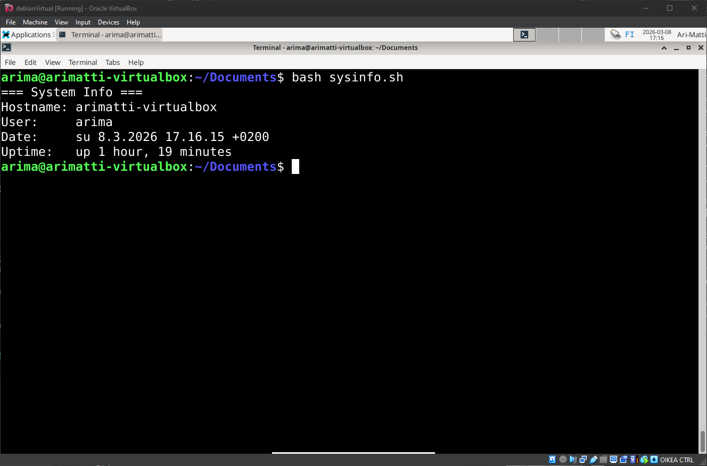

- Seuraavaksi teemme tästä ajettavan komennon.
- Teemme tämän kopioimalla sen /usr/local/bin/ kansioon ja asettamalla oikeudet.
- Poistamme myös .sh liitteen jottei sitä tarvitse kirjoittaa kun skriptiä ajetaan.

```
sudo cp sysinfo.sh /usr/local/bin/sysinfo
sudo chmod a+x /usr/local/bin/sysinfo
```

- Nyt testaamme, että kaikki toimii kirjoittamalla komennon terminaaliin.

```
sysinfo
```

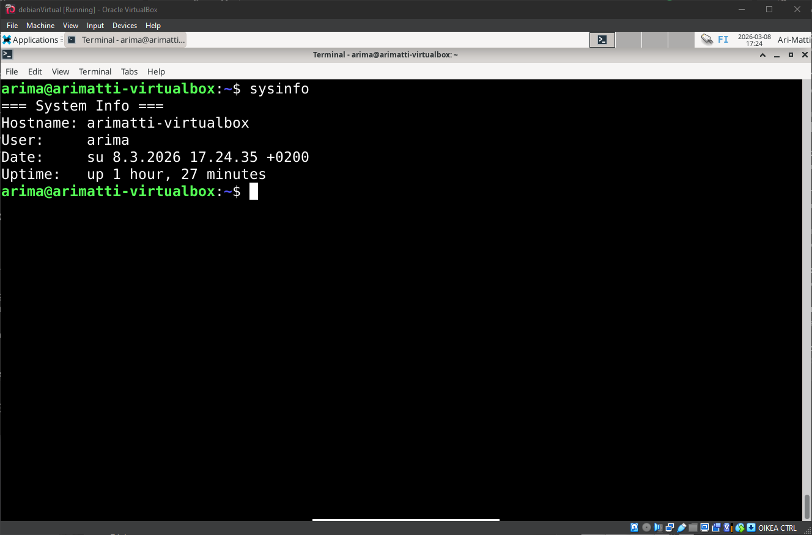

## D - Laboratorio
Tässä tehtävässä teen jonkun aijemmista kurssin arvioitavista laboratorioista. Valitsin ict4tn021-3004 ti – alkukevät 2019 -kurssin laboratorion.
Laboratorion tehtävänanto on seuraava:

```
## Tervetuloa
Olet nyt Notkea Haku Oy:n tietohallintopäällikkö – ja -osasto. Ja sait firmat keskitetyn hallinnan toimimaan.
Asenna käyttöjärjestelmä koneen kovalevylle.
## LAMP
Asenna LAMP. Tee esimerkkiohjelma, joka hakee tietueita tietokannasta. Maija ryhtyy ohjelmoimaan LAMP:illa. Tee maijalle
käyttäjä ja laita esimerkkiohjelma näkymään osoitteessa http://localhost/~maija/ . Esimerkkiohjelman tulee tulostaa
näytölle muutamia tietueita asiakastietokannasta, niiden joukossa asiakkaamme Oogle ja Zonama.
## Goodmorning.sh
Tee goodmorning.sh -skripti, joka toivottaa hyvää huomenta, kertoo koneen IP-osoitteen ja päivämäärän. Voit näyttää
myös muita tietoja, max 5 riviä. Laita skripti niin, että se toimii kaikilla käyttäjillä kaikista hakemistoista.
## Käyttäjät
Työntekijämme ovat toimitusjohtaja Nakke Nertola, Håkan Värs, Einari Mikkonen, Einari Öljysaari, Maija Maijala ja Eija
Vähäkäähkä. Tee kaikille käyttäjille esimerkkikotisivut.
Kirjoita käyttäjien nimet, käyttäjätunnukset ja salasanat tiedostoon password.txt kotihakemistossasi. Aseta tiedostolle
turvalliset oikeudet.
## Hei Python
Laita maijan kotihakemistoon Pythonin “Hei maailma” skripti. Skriptin tulee olla osoitteessa /home/maija/hei.py.
## Etäkäyttöä
Haluamme käyttää konetta Afrikasta, turvallisesti. Asenna tarvittavat palvelut. Lisää password.txt -tiedostoon
esimerkkikomennot kullekin käyttäjälle, jolla etäkäyttöyhteys avataan. Käytä niin julkista osoitetta kuin labrassa on
mahdollista.
Automatisoi kirjautuminen maija-käyttäjältä ssh:n yli tälle samalle maija-tunnukselle. Käytä julkisen avaimen menetelmää
kirjautumiseen.
## EvilNinja Beacon
EvilNinja -mato leviää verkoissa. Ennakkotietojen mukaan kaikissa evilninjan yhteydenotoissa lukee sen nimi.
Selvitä lokeista, onko evilninja yrittänyt ottaa koneeseesi yhteyttä. Analysoi
lyhyesti 1-2 keskeisintä tähän liittyvää lokiriviä. Liitä vastaus raportti.txt -tiedostoon.
## Nimipohjainen virtuaalipalvelu
Laita maijan public_html -kansio näkymään osoitteessa notkeahaku.com. Voit simuloida nimipalvelun toimintaa hosts-tiedoston avulla.
## Testamentti seuraavalle ylläpitäjälle
Kirjoita kotihakemistoosi pelkkänä tekstinä raportti.txt ja laita sille turvalliset oikeudet. Laita tähän tiedostoon
– Koko nimesi
– Opiskelijanumerosi
– Linkki läksypakettiisi
– Lista toimivista palaveluista, skripteistä ym osoitteineen
– Lista toimimattomista palveluista, skripteistä ym.
– kaikki käyttäjätunnukset ja salasanat, myös oman sudo-käyttäjäsi
Kun olet päässyt loppuun, tarkista, että olet vastannut kaikkiin tehtäviin. Huomaa, että ohje on päivittynyt tuon “Testamentti
seuraavalle ylläpitäjälle” kohdan yläpuolelta.
```

### 0. Puhdas Linux
- Tämä tehtävä tehdään uudelle Linux koneelle, tätä varten luomme uuden virtuaalikoneen VirtualBoxissa ja asennan siihen Linuxin.

### 1. LAMP asennus
- LAMP-pino tarkoittaa Linux, Apache, MySQL/MariaDB, PHP
- Kurssillamme emme käsitelleet tietokantaohjelmistoa tai PHP :ta, mutta koska minulla on näistä kokemusta aijemmin, teen ne suoraan tehtävänannon mukaisesti.
- Ensi töiksemme asennamme tarvittavat paketit, eli Apachen, MariaDB ja PHP
- Aloitamme Apachesta

```
sudo apt-get install -y apache2
sudo systemctl enable apache2
sudo systemctl start apache2
```

- Testaamme selaimella, että `http://localhost/` näyttää Apachen oletussivun:

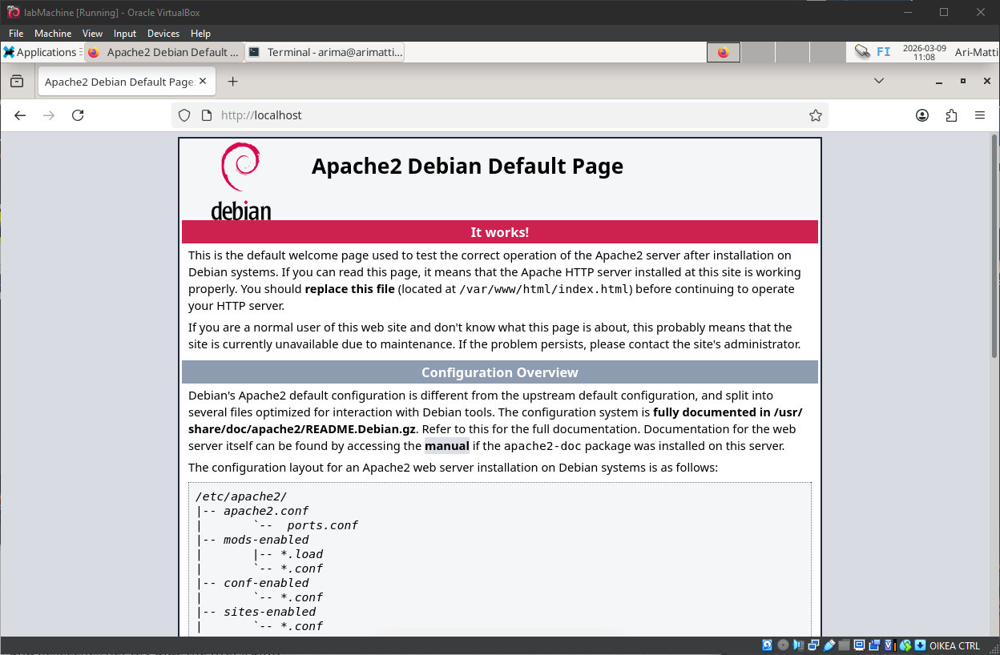

- Seuraavaksi asennamme MariaDBn ja laitamme sen päälle

```
sudo apt-get install -y mariadb-server mariadb-client
sudo systemctl enable mariadb
sudo systemctl start mariadb
```

- Viimeiseksi asennamme PHP

```
sudo apt-get install -y php php-mysql libapache2-mod-php
sudo systemctl restart apache2
```

### 2. Esimerkkitietokanta ja  PHP-ohjelma

#### Tietokanta ja käyttäjä

- Avaamme MariaDB:n

```
sudo mariadb
```

- Avautuu MariaDB komentorivi, johon teemme tietokannan

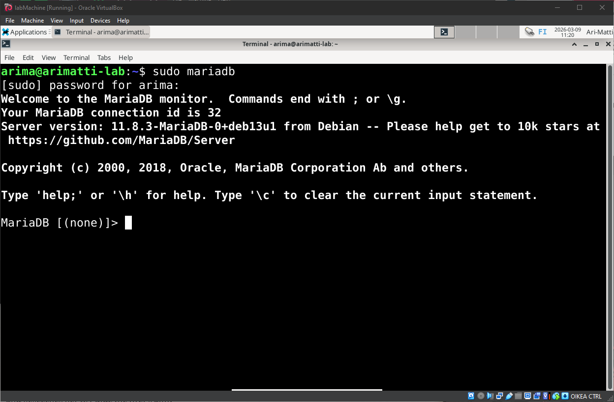

- Tähän luomme tietokannan ja käyttäjän

```sql
CREATE DATABASE asiakkaat;
CREATE USER 'lampkayttaja'@'localhost' IDENTIFIED BY 'LamppuTynka!VauvaMies0';
GRANT ALL PRIVILEGES ON asiakkaat.* TO 'lampkayttaja'@'localhost';
FLUSH PRIVILEGES;

USE asiakkaat;

CREATE TABLE asiakas (
    id INT AUTO_INCREMENT PRIMARY KEY,
    nimi VARCHAR(100) NOT NULL,
    email VARCHAR(100),
    kaupunki VARCHAR(100)
);

INSERT INTO asiakas (nimi, email, kaupunki) VALUES
('Oogle', 'info@oogle.com', 'Helsinki'),
('Zonama', 'myynti@zonama.fi', 'Tampere'),
('TechNova', 'hello@technova.io', 'Turku'),
('DataFlow Oy', 'info@dataflow.fi', 'Oulu'),
('Pilvipalvelu Ab', 'contact@pilvi.se', 'Vaasa');

EXIT;
```

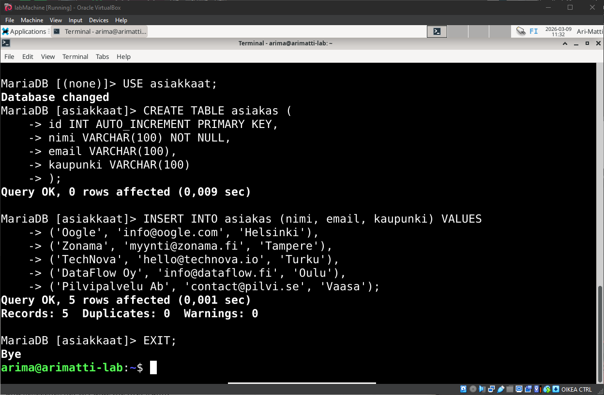

- Luomme Maija-käyttäjän, ja annamme tälle vahvan salasanan:

```
sudo adduser maija
```

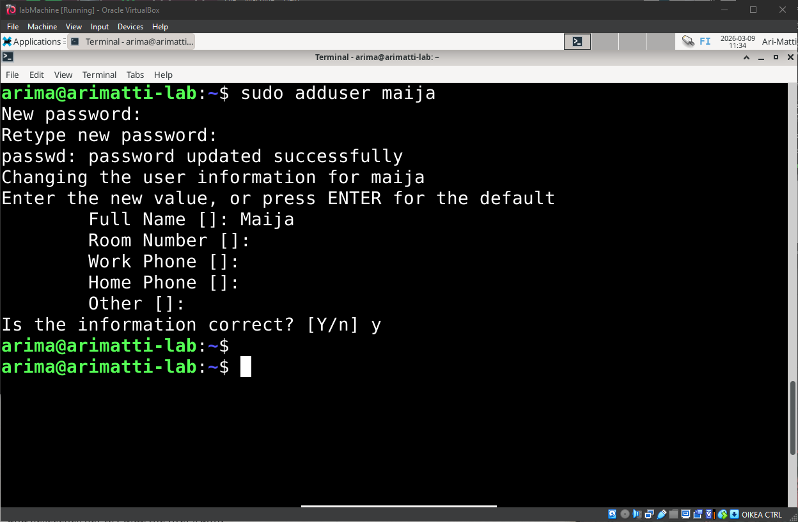

- Otamme käyttäjäkohtaiset kotisivut käyttöön Apachessa:

```
sudo a2enmod userdir
sudo systemctl restart apache2
```

- Luomme Maijalle public_html-kansion ja asetamme oikeudet:

```
sudo mkdir -p /home/maija/public_html
sudo chown maija:maija /home/maija/public_html
sudo chmod a+x /home/maija /home/maija/public_html
```

- Seuraavaksi sallimme PHP käyttäjähakemistoissa muokkaamalla tiedostoa, ja kommentoimalla rivit ohjeen mukaisesti:

```
sudo micro /etc/apache2/mods-available/php*.conf
```

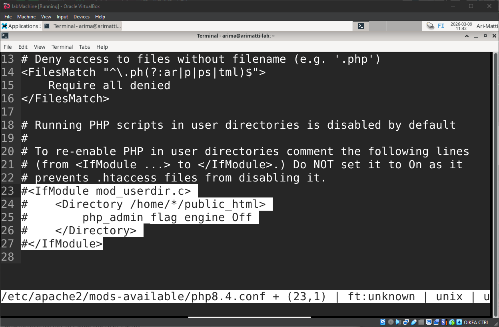

- Ja käynnistämme palvelimen uudelleen:

```
sudo systemctl restart apache2
```

#### Esimerkkiohjelma

- Nyt teemme esimerkkiohjelman maijan /public_html/ kansioon:

```
sudo micro /home/maija/public_html/index.php
```

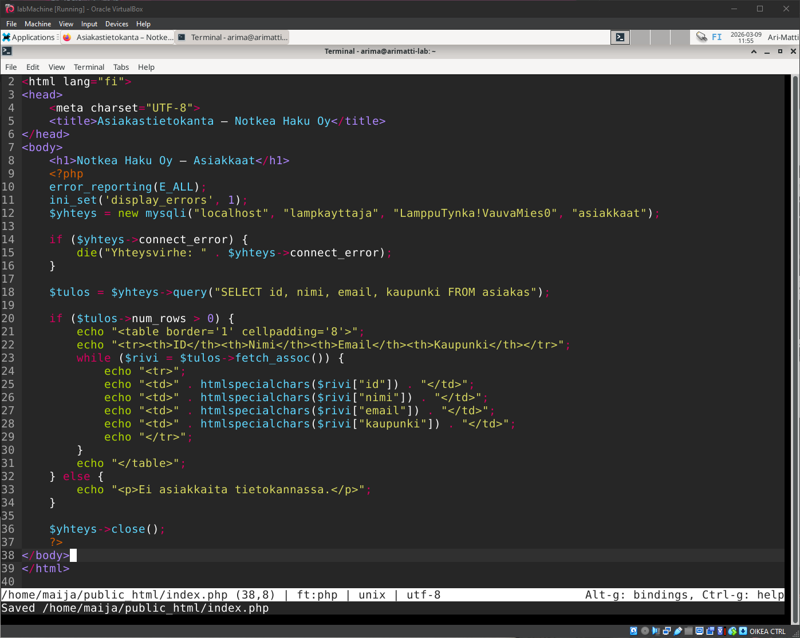

- Asetamme oikeudet tiedostolle:

```
sudo chown maija:maija /home/maija/public_html/index.php
sudo chmod 644 /home/maija/public_html/index.php
```

- Ja testaamme selaimella menemällä osoitteeseen `http://localhost/~maija/`

## Lähteet
- https://terokarvinen.com/linux-palvelimet/
- https://terokarvinen.com/2018/hello-python3-bash-c-c-go-lua-ruby-java-programming-languages-on-ubuntu-18-04/
- https://terokarvinen.com/2007/12/04/shell-scripting-4/
- https://tldp.org/LDP/abs/html/index.html
- https://terokarvinen.com/2019/arvioitava-laboratorioharjoitus-linux-palvelimet-ict4tn021-3004-ti-alkukevat-2019-5-op/?fromSearch=laboratorio
- https://www.w3schools.com/sql/default.asp
- https://www.w3schools.com/php/default.asp
